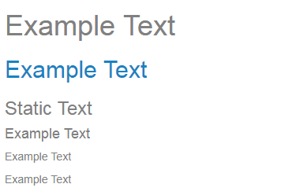
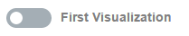

# Signals Apps SDK API V3.8


## Overview


## The App Model

The Signals Apps API allows you to create diverse range of apps. However, most of them will follow the same pattern
* prompt the user for some input parameters through the app user interface, then 
* do some analytics, and then
* present the results of the analytics to the user through different visualizations. 

More complex apps can repeat one or more of these steps, building a workflow or sequence of actions.


This design pattern is supported by the following elements:

- **App parameters**: The app parameters hold the user input data. The app parameters are used to parametrize either the analytics or the visualizations. Some of the app parameters can be exposed to the user through the app's UI.

- **App user interface (UI)**: The app UI is rendered as vertical panel at the left hand which contains the user input controls like table, column selectors, input literal values, action buttons to lauch a calculation etc...

- **Visualization area**: The central part of the app holds the visualizations generated by the app. The Signals Apps API enables you create multiple visualizations and organize them by layouts. The visualization layouts are displayed by the UI user interactions, e.g: clicking a button, changing a combobox selector...

- **Analytics**: Most of the apps will run some analytics or data transformations to produce the output data to be visualized. The transformations or calculations can be implemented in many ways. Yet, the most common case is through Spotfire data functions.

Each of these elements are required when creating a new app, and are defined via json files or, in the case of the visualizations, by a c# file.

- [**app.json.**](#appjson) This json file defines the app name, icons, descriptions, images... and more importantly the App's [input parameters](#parameters)
- [**app_ui.json.**](#appuijson) This file defines how the user interface will be presented to the user, and how the different [visualizations layouts](#visualization-layouts) will be shown to the user depending on the user interactions
- [**AppVisuals.cs.**](#appvisualscs) This c-sharp file contains functions that  create and configure the visualizations of the app. The visualizations are created using the [TIBCO Spotfire Visualization API](https://docs.tibco.com/pub/doc_remote/sfire-analyst/7.11.0/TIB_sfire-analyst_7.11.0_api/html/N_Spotfire_Dxp_Application_Visuals.htm)
- [**Datafunction.xml**](#terr-datafunctions). This xml file contains the analytics data function definitions. The data function xml defintion file can be obtained creating the data function in Spotfire and then exporting the data function defintion as an xml file. Notice that that the data function input parameters names must match the app's input parameters ones.

### app.json
The App Store needs some information in order to visualize your App as an entry in the store. This is done via the app.json file, embedded in the App project you are working on.
The minimal metadata we need to specify is:

```javascript
//app.json
{
  "name": "Name of the App",
  "description": "Description",
  "group": "Core",                   // groups apps in the store
  "enabledIcon": "images/icon.png",
  "disabledIcon": "images/icon.png",
  "image": "images/preview.png",     // preview image to display in the App List
  "pageName": "App Page",            // default page name for new app instances
  "new": true,                       // whether to include in the 'new' filter in the App List
  "parameters": [],                  // optional
  "filteringSchemes": [],            // optional
  "markings": [],                    // optional
  "dataMappings": [],                // optional
}
```

#### Parameters

The app.json defines the app parameters (either inputs or outputs). The parameter definition includes the parameter type. The parameter types are important because the parameters might be used as input for data functions ,as part of expressions in visualizations axes or for other usages which require a type safe expression.

Certain parameters can have relations between them and be configured using `parentSettings` property. Some examples are:
- Column Parameter needs a Table Parameter because it depends on the value of this "parentParameter" to list its columns in the [ColumnSelector](#columnselector).
- Combined with [Data Mapping](#data-mappings) to create parameters that are auto-populated with values depending on the parentParameter value (like a switch statement).


```javascript
//app.json
{
  "parameters": [] 
}
```

Each parameter is an object added to the parameters array, and accepts different properties:

- `name`. Descriptive parameter name
- `id`. Parameter key
  - Must be an identifier-style string, starting with a letter and containing only letters and digits. 
  - It can be used as a scope for visual components, or as input/output parameters in a data function definition. 
- `type`. Parameter type, must be one of:
  * `table`
  * `column`
  * `columnValue`
  * `value` (requires `datatype`)
- `datatype` (optional). Specifies the datatype used to store parameter values
  - Only valid for `value` paremeter types
  - Must be one of:
    * `string` (default)
    * `boolean`
    * `integer` (32-bit signed integer)
    * `float` (32-bit floating-point values, 7 digits precision)
    * `double` (64-bit floating-point values, 15-16 digits precision)
- `multi` (optional). Specifies that the parameter is an array
  - `true`/`false` (default `false`)
  - If the parameter `id` is linked to a [Select](#select) component or similar, `multi` property in the component will be true by default.
- `hidden` (optional). Specifies whether the parameter is hidden in the UI
  -  `true`/`false` (default `false`)
  -  if hidden, the parameter must be assigned a value the first time the app is instantiated
  -  hidden parameters can be initialized using [Data Mapping](#data-mappings) or a plain scope assignment
- `hiddenInDataModelUI` (optional). Specifies whether the parameter appears in the `Data Model` settings of the app's configuration (via the "Signals Apps" home page)
  -  `true`/`false` (default `false`)
- `excludeFromProtocol` (optional). Specifies whether the parameter is saved when creating a protocol (via the "Signals Apps" home page)
  -  `true`/`false` (default `false`)
- `parentSettings`. Object with the parent parameter settings.
  * `id`. Parameter key. When the parameter is configured as `type: column`, an additional parameter need to be set to define the datasource of this column..
  * `includeRelated`. Boolean. If true, output also shows columns from any related tables that fullfill the data validation otherwise just consider the columns in the parentParam selected table. 
  * `includeLinkedOnly`. Boolean. If true, output only those columns from related tables that have linked information between the two tables (as defined via their relations) otherwise include all columns that fullfill the data validation.
- `dataValidation`. Array that contains the data validation rules.
  - `column` parameter types only.
  - Read more about this property in the [Data Validation](#data-validation) section.


##### Parameters in Data Functions
The developer must take into account that each parameter will pass to the data function as a type safe value, except in the case that the parameter is configured as `multi` and the datafunction type is `Value`, in this case the parameter must be configured in the datafunction allowed types as `string`, because it will be passed as a serialized array json (to ensure deserialization in Terr).


##### Data Validation
Data Validation is applied only to the `type: column` parameters to filter the columns available in their [ColumnSelector](#columnselector) component. A column is considered a valid option for the selector if all expressions have been evaluated to true. 

Each dataValidation object of the array has the following properties:

- `expression`. Spotfire column boolean expression. 
  - During evaluation of the expression the following substitutions are made:
    - "`__TABLE`" is replaced with the table name and 
    - "`__COLUMN`" is replaced with the column name.
- `description`. User friendly message to display the rule does not pass.
  - The description is not used in any component right now.


Below are some examples of restrictions that could be applied to a column parameter:
```javascript
{
  "dataValidation": [
    {
      "expression": "\"${__TABLE}.{__COLUMN}.{DataType}\" ~= \"String\"",
      "description": "Only columns of type `String` are permitted"
    },
    {
      "expression": "\"${__TABLE}.{__COLUMN}.{DataType}\" ~= \"Real\"",
      "description": "Only columns of type `Real` are permitted"
    },
    {
      "expression": "Count([__COLUMN]) > 0",
      "description": "Only columns with at least one valid value are permitted"
    },
    {
      "expression": "Count() - Count([__COLUMN]) = 0",
      "description": "Only columns with no empty values are permitted"
    },
    {
      "expression": "UniqueCount([__COLUMN]) > 2",
      "description": "Only columns with at least 3 unique values are permitted"
    },
    {
      "expresion": "ColumnProperty([__COLUMN], \"Signals.Source.Field.Type\") ~= \"Text$\"",
      "description": "Only columns where the `Signals` data type is`Text` are permitted"
    }
  ]
}
```

**Note:** If the Spotfire table structure or underlying data changes such that a column selection is no longer valid, then any invalid selections will be reset.


##### Example

The following example will create an app where the `inputColumn` it is going to list from the selected `inputTable` only the columns with *"No empty rows"*.

```javascript
//app.json
{
  "parameters": [{
    "name": "Table Input",
    "id": "inputTable",
    "type": "table"
  }, {
    "name": "Column Input",
    "id": "inputColumn",
    "type": "column",
    "parentSettings": {
      "id": "inputTable"
    },
    "dataValidation": [{
      "expression": "Count() - Count([__COLUMN]) = 0",
      "description": "No empty rows"
    }]
  }]
}

//app_ui.json
{
  "components": [{
    "component": "TableSelector",
    "scope": "inputTable"
  }, {
    "component": "ColumnSelector",
    "scope": "inputColumn"
  }]
}
```

 

#### Filtering Schemes
Filter schemes allow you to pre-define the list of tables and/or columns that will be displayed on the Spotfire filter panel.

Filtering schemes take the form of an array in the root of the app.json object. 

```javascript
//app.json
{
  "filteringSchemes": []
}
```

Available propertes for a filter scheme are:

- `name` (optional). `default_filter` by default. Name of the filtering scheme.
- `global` (optional). Boolean, `false` by default.
  * `true`. The filtering scheme will be created with the provided name and could be shared between different apps.
  * `false`. The filtering scheme will be prefixed with the app namespace and will be used only by the app it belongs to. When the app is closed, the filtering scheme will be removed from the document.
- `tables` (optional).
  * If not defined, the filtering scheme will contain all the tables.
  * Array of table objects, each one of them has to define at least one of the two optional parameters: `name` or `parameterId`; if the two parameters are defined simultaneously, the table will be added to the schema when the `parameter` equals the `name` (The behaviour will be like a switch statement for the `parameter` where the case is the `name` and the default is the absent of `name` property). Each table object is going to accept fixed properties:
    * `name` (optional). Name of the table the developer wants to add to the scheme.
    * `parameterId` (optional). Id of the parameter that contains the name of the table to add, this can be linked to a [TableSelector](#tableselector).
    * `columns` (optional). An array of column objects, each one of them has to define one of the two optional parameters: `name` or `parameterId`. If the columns array is empty or not defined, all the columns will be added to the scheme.
      + `name` (optional). Name of the column the developer wants to add to the scheme.
      + `parameterId` (optional). Id of the parameter that contains the name of the column/columns to add, this can be linked to a [ColumnSelector](#columnselector).
      + `filterType` (optional). By default will be handled by spotfire, but the user can force an input type from the following list:
        - `CheckBoxFilter`
        - `CheckBoxHierarchyFilter`
        - `ItemFilter`
        - `ListBoxFilter`
        - `RadioButtonFilter`
        - `RangeFilter`
        - `TextFilter`


##### Example

The following example will create an app with two Filtering Schemes: 
  - "default_filter". This one will have a prefix with the App NameSpace and it will be only used in the App. Will show filters for the following tables:
    - Table named "Targets":
      - A CheckBoxFilter for "target" column.
      - An automatic filter for the selection in "inputColumn" parameter.
    - Table selected in "inputTable" parameter except if the table is "exampleTable":
      - A RangeFilter for "exampleColumn" column.
      - An automatic filter for the selection in "inputColumn" parameter.
    - If the table selected in "inputTable" is "exampleTable":
      - An automatic filter for "exampleTableUniqueColumn" column.
      - An automatic filter for the selection in "inputColumn" parameter.
  - "shared". This is a Global Filtering Scheme that can be shared between different pages. Will show filters for the following tables:
    - Table named "Targets":
      - A CheckBoxFilter for "target" column.
      - An automatic filter for the selection in "inputColumn" parameter.

```javascript
//app.json
{
  "parameters": [{
    "name": "Table Input",
    "id": "inputTable",
    "type": "table"
  }, {
    "name": "Column Input",
    "id": "inputColumn",
    "type": "column",
    "parentSettings": {
      "id": "inputTable"
    }
  }],
  "filteringSchemes": [{
    "tables": [{
      "name": "Targets",
      "columns": [{
        "name": "target",
        "filterType": "CheckBoxFilter"
      }, {
        "parameterId": "inputColumn"
      }]
    }, {
      "parameterId": "inputTable",
      "columns": [{
        "name": "exampleColumn",
        "filterType": "RangeFilter"
      }, {
        "parameterId": "inputColumn"
      }]
    }, {
      "parameterId": "inputTable",
      "name": "exampleTable",
      "columns": [{
        "name": "exampleTableUniqueColumn"
      }, {
        "parameterId": "inputColumn"
      }]
    }]
  }, {
    "name": "shared",
    "global": true,
    "tables": [{
      "name": "Targets",
      "columns": [{
        "name": "target",
        "filterType": "CheckBoxFilter"
      }, {
        "parameterId": "inputColumn"
      }]
    }
  ]
}
```

```javascript
//app_ui.json
{
  "components": [{
    "component": "TableSelector",
    "scope": "inputTable"
  }, {
    "component": "ColumnSelector",
    "scope": "inputColumn"
  }]
}
```


#### Markings
The app can define specific markings that will be handled by the SDK to use in visualizations. The `markings` property takes the form of an array in the root of the `app.json` object. 

```javascript
//app.json
{
  "markings": []
}
```

Each marking is an object added to the `markings` array, and accepts different properties:

- `name`. Name of the marking the developer wants to add to the app. It will be added with tha namespace of the app.
- `global`.
  * `true`. The marking will be created with the provided name and could be shared between different apps.
  * `false` (default). The marking will be prefixed with the app namespace and will be used only by the app it belongs to. When the app is closed, the marking will be removed from the document.
- `color`. Color of the marking. 
  - Must be a valid string from the enum [`System.Drawing.KnownColor`](https://docs.microsoft.com/en-us/dotnet/api/system.drawing.knowncolor?view=netframework-4.7.2#fields).


##### Example

```javascript
//app.json
{
  "markings": [
    {
      "name": "First Marking",
      "color": "Aquamarine"
    }, 
    {
      "name": "Global Marking",
      "global": true,
      "color": "Chocolate"
    }, 
    {
      "name": "Invalida Color (White)",
      "color": "dasd"
    }, 
    {
      "name": "No Color (Black)"
    }
  ]
}
```

---

#### DataFunctions
Apps usually need to execute one or more data functions to compute its analytics. The framework requires you to define all the data functions that are being used by the app. This configuration will help the framework to decide how to best connect the data functions with the rest of the elements of an app (mainly parameters and visual components).

`datafunctions` is an array of objects, so you can add as many as you need. We are doing a bit more than just defining two data functions as you can see. Each entry in `datafunctions` allows to you to add some customization to how the inputs and the outputs of a data function behave.

- `inputs`: in this section you can configure a filter to be applied to a input parameter to limit the input data
- `outputs`: this section helps you to configure how the output is configured (i.e. add a column to a existing table vs create a new table)


Regarding filtering schemes, each scheme is an object added to the datafunctions array, and accepts different properties:

- `id`. Unique identifier for the datafunction.
- `path`. Path to the file that contains the datafunction definition. This file must be added to the project as an *Embedded Resource*. Only used in [TERR Datafunctions](#terr-datafunctions).
- `executor`. Object that contains the custom datafunction executor reference. Only used in [Custom Datafunctions](#custom-datafunctions). this object takes two mandatory properties:
  * `class`. [AssemblyQualifiedName](https://msdn.microsoft.com/en-us/library/system.type.assemblyqualifiedname.aspx) pointing to the `CustomTypeIdentifiers` class used to register the datafunction in the `AddIn.cs`.
  * `typeIdentifier`. Name of the `CustomTypeIdentifier` that belongs to the above defined class, used to register the datafunction.
- `inputs`. List of inputs in which the developer wants to apply some kind of filtering. Each object accepts:
  * `parameterId`. Id of the input [parameter](#parameters). 
  * `filteringSchemeId`. Name of the [Filtering Scheme](#filtering-schemes) that applies to the input.
  * `markings`. Array of strings. This array contains the markings that will filter this input. 
- `outputs`. Every output with an especific behavior (e.g. column outputs) should be defined in this array. Each object is going to accept fixed properties:
  * `parameterId`. Id of the output [parameter](#parameters). 
  * `table`. Id of the table [parameter](#parameters) or table name or table name with namespace in which the column is going to be added.
  * `action` (optional). Action to perform for this datafunction output. 
    + `AddOrReplaceTable`. Available when the output type is Table. Adds or replace the table (If there are column matching problems, Spotfire dialog is fired).
    + `AddOrForceReplaceTable`. Available when the output type is Table. Adds or forces the table replace (No Spotfire dialog is fired), which potentially causes the columns to loose user defined relations, user defined visualizations, etc.
    + `AddColumn`. Available when the output type is Column (adds a single column) or Table (adds multiple columns).


##### Dynamic Inputs

Sometimes the developer wants to use an unknown number of inputs that are based on the user selection, for that purpose we have **Dynamic Inputs** that are automatically created using some components and has a defined structure in order to use the inputs in the DataFunction:

###### Dynamic Inputs ColumnSelector

If the [ColumnSelector](#columnselector) has a associated [parameter](#parameters) and his parent param `table` accepts multiple inputs (`"multi": true`), then the linked parameter of the datafunction behaves like follows, being the parameter/input/scope `columnsSelected`:

1. The defined input parameter `columnsSelected` should be an input type `Value` and it will contain an array of json objects (example below) serialized used as descriptor of the dynamic inputs .
    ```javascript
    [{
      "table": "Table name",
      "column": "Column name"
    }]
    ```

2. A new input parameter `columnsSelected.tableNames` will be created with a json descriptor of the added tables describing the input name (tableAlias) and the actual name of the table.
    ```javascript
    {
      "tableAlias": "Table name",
      "table2Alias": "Table 2 name"
    }
    ```

3. There will be additional input parameters `tableAlias` added to the datafunction, being `tableAlias` different per table and defined in the json descriptor. This input parameter will contain the table (combination of the selected columns).


##### Data Merger Inputs

If the developer wants to implement the Terr `dataMerger` using helper inputs automatically created, he can configure this behavior in the [ButtonDf](#buttondf) component. The dataMerger creates the following inputs for the datafunction:

- `tableNames`. Object with the mapping of the dynamicTables and the actual table names.

- `tableRelations`. DataMerger object with the merging order.

- `{ColumnSelectorParam}Descriptor`. Descriptor with an array of objects containing the `tableName` and `columnNames` of each table added in this selector.

- `dynamicTable{index}`. Each of the dynamicTables added as a `Table` input parameter. It's possible to map this name with the actual tableName using `tableNames` object.


```javascript
// Example DataMerger for ButtonDF
{
  "dataMerger": {
    "tableParameter": "experimentDesign",
    "columnSelectorParameters": ["fixedVals", "randomVals", "groupCol"] 
  }
}
```


##### Custom DataFunctions

To create a Custom Datafunction, the developer needs to follow the [Spotfire Guide](https://community.tibco.com/wiki/create-custom-data-function-tibco-spotfire). But in the SDK case, the datafunction definition and parameter mapping is automatically handled by the framework, the developer only needs to create a [CustomDataFunctionExecutor](https://community.tibco.com/wiki/create-custom-data-function-tibco-spotfire#toc-12) and register it inside the `AddIn.cs` using a `CustomTypeIdentifier`.

The only thing to keep in mind is that the `parameter id` and the inputs/outputs values of the custom datafunction must have the same name and be defined inside the `datafunctions` section of the `app.json` file. An example app.json would be:

```javascript
{
  "datafunctions": [{
    "id": "example_datafunction",
    "executor": {
      "class": "PerkinElmer.Apps.SampleApp.ExampleFunctionTypeIdentifier, PerkinElmer.Apps.SampleApp",
      "typeIdentifier": "ExampleDatafunctionExecutor"
    },
    "inputs": [
      {
        "parameterId": "inputTable"
      },
      {
        "parameterId": "inputColumn",
        "filteringSchemeId": "default_filter"
      }
    ],
    "outputs": [
      {
        "parameterId": "output",
        "table": "inputTable",
        "action": "AddColumn"
      }
    ]
  }]
}
```


##### TERR DataFunctions

The definition and configuration of the TERR datafunctions can be found in two different places:

- **Definition**: each data function is defined in a XML descriptor (in DFD format).
- **Configuration**: the configuration of the data function is done in `datafunctions` section in the `app.json` file

The simplest `datafunctions` configuration section would be like:

```javascript
//app.json
"datafunctions": [
  {
    "id": "default",
    "path":  "datafunction.dfd"
  }
]
```

You don't need to add anything about how to connect the data function inputs and outputs. That's done by the framework. The `default` data function is the one that is executed by the `ButtonDF` component if you don't specify anything else.


This is how a data function descriptor file looks like:


```xml
<!-- datafunction.dfd -->
<?xml version="1.0"?>
<ScriptFunctionDefinition xmlns:xsd="http://www.w3.org/2001/XMLSchema" xmlns:xsi="http://www.w3.org/2001/XMLSchema-instance">
  <Version Major="1" Minor="0" />
  <Name>Example</Name>
  <Script>
    outputColumn &lt;- columnValue
  </Script>
  <Language>TERR</Language>
  <Input>
    <Name>columnValue</Name>
    <Type>Column</Type>
    <DisplayName>Column Value</DisplayName>
  </Input>
  <Output>
    <Name>outputColumn</Name>
    <Type>Column</Type>
    <DisplayName>Output Column</DisplayName>
    <Description />
  </Output>
  <Description />
</ScriptFunctionDefinition>
```

This XML file defines how a data function is implemented and how it connects with the rest of the app. For each data function you need to provide a descriptor like this. The framework uses the input and output names in this descriptor to connect the data function to the app once it is added to the document. The binding of the inputs and outputs tries first to find a `parameter` that matches the name. If it cannot find it then it tries to find a component `scope` that matches the name. The result of this is that you as a developer don't need to write any boilerplate code to instantiate and run the data function.

A more complex example defining two datafunctions. In this example we are configuring the input parameter `columnValue` to use the default filter. Also, the output parameter `cluster` is configured to be attached to an existing table (specified by the parameter `inputTable`) instead of creating a new table which would be the default behaviour. The second data function is just declared and given an ID, but the inputs and outputs will get the default configuration.

```javascript
//app.json
"datafunctions": [
  {
    "id": "default",
    "path":  "datafunction.dfd",
    "inputs": [
      {
        "parameterId": "columnValue",
        "filteringSchemeId": "default_filter"
      }
    ],
    "outputs": [
      {
        "parameterId": "cluster",
        "table": "inputTable"
      }
    ]
  },
  {
    "id": "df2",
    "path": "datafunction2.dfd"
  }
]

```


##### Example

```javascript
//app.json
{
  "parameters": [
    {
      "name": "Table Selector",
      "id": "tableSelector",
      "type": "table"
    },
    {
      "name": "Column Input",
      "id": "columnValue",
      "type": "column",
      "parentSettings": {
        "id": "tableSelector"
      }
    },
    {
      "name": "Column Output",
      "id": "outputColumn",
      "type": "column"
    }
  ],
  "datafunctions": [
    {
      "id": "default",
      "path": "datafunction.dfd",
      "inputs": [{
        "parameterId": "columnValue",
        "filteringSchemeId": "default_filter"
      }],
      "outputs": [{
        "parameterId": "outputColumn",
        "table": "tableSelector"
      }]
    },
    {
      "id": "example_datafunction",
      "executor": {
        "class": "PerkinElmer.Apps.SampleApp.ExampleFunctionTypeIdentifier, PerkinElmer.Apps.SampleApp",
        "typeIdentifier": "ExampleDatafunctionExecutor"
      },
      "inputs": [
        {
          "parameterId": "tableSelector"
        },
        {
          "parameterId": "columnValue",
          "filteringSchemeId": "default_filter"
        }
      ],
      "outputs": [
        {
          "parameterId": "output",
          "table": "outputColumn",
          "action": "AddColumn"
        }
      ]
    }
  ]
}
```

```javascript
//app_ui.json
{
  "components": [{
    "component": "TableSelector",
    "scope": "tableSelector"
  }, {
    "component": "ColumnSelector",
    "scope": "columnValue"
  }, {
    "component": "ButtonDF",
    "scope": "executeDf",
    "value": "Run"
  }, {
    "component": "ButtonDF",
    "scope": "executeDf",
    "value": "Run Custom DF",
    "params": {
      "datafunction": "example_datafunction"
    }
  }]
}
```

Check the [ButtonDF](#buttondf) for more info about how to run a data function from the app.

#### Data Mappings
The app has the possibility to define several data mappings to apply a default value to the parameters and limit the options of the selectors that are filled with tables/columns.
If the developer wants to apply one of the defined data mappings in the application, the `Scope["dataMapping"]` should match the name of one data mapping. 

```javascript
//app.json
{
  "dataMappings": []
}
```

Each scheme is an object added to the dataMappings array, and accepts different properties:

- `name`. Name of the data mapping. 
- `mappings`. This array will contain the mapping of each parameter. Each object is going to accept fixed properties:
  * `parameterId`. Id of the input [parameter](#parameters). 
  * `includeAll` (optional). Boolean, `false` by default. If `true`, by default all the options will be shown to the user and the `values` array can be defined to prioritize the autopopulated options.
  * `values`. Array of [Data Mapping Values](#data-mapping-value) used to filter the component of the parameter. These values are used as the default when no condidionValues apply. The first existing value from the array would be the default value for this parameter. 
  * `defaultValues` (optional). Integer. Only used when the parameter has the property `"multi": true`. It defines the number of elements from the `values` list to use in the parameter instead of taking only 1 (default behaviour). 
  * `conditionalValues`. List of objects that will contain a condition in which the values are going to be applied.
    + `parentValue`. [Data Mapping Value](#data-mapping-value) that resolves true if it matches with the actual value of the parent parameter. 
    * `includeAll` (optional). Boolean, `false` by default. If `true`, by default all the options will be shown to the user and the `values` array can be defined to prioritize the options to be autopopulated.
    + `values`. Array of [Data Mapping Values](#data-mapping-value) used to filter the component of the parameter. The first existing value from the array would be the default value for this parameter.
    + `defaultValues` (optional). Integer. Only used when the parameter has the property `"multi": true`. It defines the number of elements from the `values` list to use in the parameter instead of taking only 1 (default behaviour). 


##### Data Mapping Value

The DataMappingValue can take two forms:
- `Object`. With as many Column/Table properties option needs to match. Every property in the object acts as logic AND. `{"Feature": "Normalized"}`  
- `String`. It's automatically convert into an object as follows.
  - `"MyValue"` => `{"Name": "MyValue"}`

**Note**: DataMapping Object with custom properties works only when the parameter is a `hiddenInDataModelUI` one.

DataMappingValues are indeed objects, and each object has a `key` and a `value`; the `value` (or the `String` if it is not using objects) can be defined with different expresions as:
* Literal (eg. `"Option 1"`)
* [Regex](https://en.wikipedia.org/wiki/Regular_expression) (eg. phone number validation `"regex:^\+?[0-9]{3}-?[0-9]{6,12}$"`) 
* [Glob](https://en.wikipedia.org/wiki/Glob_(programming)) (eg. options begining with the literal "Sample" `"glob:Sample*"`).

##### Example

```javascript
//app.json
{
  "parameters": [{
    "name": "Table Selector",
    "id": "tableSelector",
    "type": "table"
  },{
    "name": "Column Selector",
    "id": "columnSelector",
    "parentSettings": {
      "id": "tableSelector"
    },
    "type": "column"
  },{
    "name": "Unique Valyes Selector",
    "id": "columnValuesSelector",
    "parentSettings": {
      "id": "columnSelector"
    },
    "type": "value",
    "multi": true
  }],
  "dataMappings":[{
    "name": "Mapping 1",
    "mappings": [{
      "parameterId": "tableSelector",
      "values": [ "table 1", "regex:\\w+\\s+\\w+", "glob:table*", {"Name": "glob:norm*", "TableProp": "featured"} ]
    }, {
      "parameterId": "columnSelector",
      "values": ["glob:Column *"],
      "conditionalValues": [{
        "parentValue": "table 1",
        "values": [ "column 1", "column 2" ]
      }, {
        "parentValue": "glob:Sample*",
        "values": [ "column 2", "column 3", "regex:^\+?[0-9]{3}-?[0-9]{6,12}$" ]
      }, {
        "parentValue": {"TableProp": "featured"},
        "values": [ {"ColProp": "glob:norm*"} ]
      }]
    }, {
      "parameterId": "columnValuesSelector",
      "values": ["glob:Gene_*"],
      "conditionalValues": [{
        "parentValue": "column 1",
        "values": [ "glob:*" ] // Select All
      }, {
        "parentValue": "glob:Column *",
        "values": [ "regex:^\+?[0-9]{3}-?[0-9]{6,12}$" ],
        "defaultValues": 2 // Select the two first columns if they exist
      }]
    }]
  }]
}
```
```javascript
//app_ui.json
{
  "components": [{
    "component": "TableSelector",
    "scope": "tableSelector"
  }, {
    "component": "ColumnSelector",
    "scope": "columnSelector"
  }, , {
    "component": "ColumnValuesSelector",
    "scope": "columnValuesSelector"
  }]
}
```

```csharp
//App.cs
public override void ViewController()
{
    Scope["dataMapping"] = "default_mapping";
}
```


#### Upgrades

When an application changes its assembly version, the App Upgrade procedure is always executed and the steps to upgrade the apps are the following ones:
1. Save the App Scope.
2. Save the [Data Mapping](#data-mappings) .
3. Reset the App and Remove:
    1. Scopes
    2. Views
    3. `app.json`
    4. `app_ui.json`
    5. ActionFunctions
    6. **Datafunctions** and output tables and columns.
    7. Document Properties
    8. Filtering Schemes
    9. Markings
4. Restore the old [Data Mapping](#data-mappings) in the new `app.json`. 
5. Modify the saved app scope executing `scopeChanges` actions synchronously in ascendent version order.
6. Restore saved Scope.
7. Initialize Application. Resources from new app version which includes: [actions](#action), [watchers](#scope.watch), [visualizations](#visualization-layouts), [datafunctions](#datafunctions), [filteringSchemes](#filtering-schemes), [markings](#markings), [views](#views).
8. Execute `afterInit` actions synchronously in ascendent version order.


The Upgrades are defined in the `app.json` in the `upgrades` property as an array of objects with the following properties:
- `"version" : "1.0.1"` => Assembly version of the app the user goes to.
- `"description" : "<b>Features</b>"` => Small description of this upgrade, new features, bug fixing, etc. Html tags can be used in the description.
- `"scopeChanges" : "actionName"` => Optional. Name of the [action](#actions) that will be fired prior to the app Initialization, use this action to make changes to the scope to ensure that is backwards compatible. This action has an `AppScope` variable as argument and no return.
- `"afterInit" : "actionName"` => Optional. Name of the [action](#actions) that will be fired after upgrading the app, usefull to make changes like data modifications, run datafunctions, etc. This action has the app (`BaseComponentsApp` class) as argument and no return.


##### Use cases

1. App parameters definition changes.
    - From the last version, the only change has been the rename of one of the params, in that case the developer needs to implement a `scopeChanges` action to copy the value from the "old" parameter id to the new one.
2. App data functions changes.
    - If the user had saved the document with the datafunction executed, the developer can detect that and use `afterInit` action when upgrading to run the datafunction again for the user (since the SDK had removed the outputs when upgrading). This datafunction is the datafunction of the new version of the app, the developer does not need to access the datafunction in order to modify the script/parameters... all this is done automatically by the SDK, that way the developer only needs to run it again if necessary.

**Note**: You can learn more about this use cases in the examples.

##### Example

```javascript
// app_ui.json
{
  "upgrades": [{
    "version": "1.0.1",
    "description": "<ul><li>Datafunction improvement</li></ul>"
  }, {
    "version": "1.0.2",
    "afterInit": "Upgrade 1.0.2",
    "description": "<ul><li>Cosmetic improvements</li></ul>"
  }, {
    "version": "1.0.3",
    "scopeChanges": "NewScope 1.0.3",
    "afterInit": "Upgrade 1.0.3",
    "description": "<ul><li>Datafunction improvement</li></ul>"
  }]
}
```

```csharp
// App.cs
[ActionDefinition("NewScope 1.0.3")]
public void Scope100(AppScope upgradeScope)
{
  // From the last version, the only changed has been the rename of one of the params
  // previously called `inputTable` and in the new version is `table`
  // With the following code we are copying the value of the old `inputTable` scope
  // to the new `table` scope to maintain backwards compatibility
  upgradeScope["table"] = upgradeScope["inputTable"];
  upgradeScope["table.value"] = upgradeScope["inputTable.value"];
}

[ActionDefinition("Upgrade 1.0.3")]
public void Upgrade103(BaseComponentsApp context)
{
  // When upgrading, this code is going to find out if the datafunction was executed
  // and if so, we are going to execute it again because when upgrading an app
  // the SDK is resetting the state and that includes DataFunctions (which causes the
  // columns added from the df to be removed from the document)
  if (context.Scope["visualizationLayout"] != "default")
      context.Scope.Emit("executeDf.click");
}
```


### app_ui.json
app_ui.json is the file where all the user interface is going to be defined. It has a defined structure, and lots of options that we are going to define in the following lines. The structure for and empty project should look like this:

```javascript
{
 "components": [],
 "views": [],
 "visualizationLayouts": []
}
```

#### Components
Each component is an object added to the components array, and accepts different properties:

- `component`. The name of the component.
- `scope`. The variable to store the values the component is going to use/create (accesible from the [ViewController](#viewcontroller) as `Scope["componentScope"])`.
- `value` (optional). This is the default value for the [Scope](#scope) variable.
- `values` (optional). An array of objects where the developer can assign different values to specific scopes for complex components. Each value object is going to accept fixed properties:
  * `scope`. The variable to store the values. Usually will take the form of "parentScope.childScope".
  * `value`. This property accepts all json types (arrays, objects, booleans, numbers) as it will be stored to be populated directly in the UI.
  <!-- * `state`. Boolean. If true, this scope will be serialized when the document is saved.
  * `root`. Boolean. If true, this scope will be shared between apps that also have this scope and it's also root. Use case is in panels, where the user wants to share the state of the panel between different pages (Every page has a new instance of the PanelApp). -->


##### Apps Without UI

The user can create an App to be used as a dashboard where the user interface on the left part of the page is not needed. For that purpose the developer can remove the `"components": []` array from the `app_ui.json` file or just define an empty array.


##### Horizontal Layout

The components are always place in a vertical layout following the `components` array order. But in some cases the user wants to place two components in the same line, for that matter, most of the components implement a child scope called `myScope.wrapperAttributes`; using this scope we can modify the vertical default behavior to place the components in a different layout.

In the most common scenario, to create an horizontal layout, the style of the wrapper component (edited in `myScope.wrapperAttributes`) must be set to `display: inline-block` and `width: 50%`, being this percentage the space that this component will occupy in the horizontal layout.

As an example, we are going to show how the [FilterToggle](#filtertoggle) component is defined internally to meet the given requirements.

```javascript
// app_ui.json
{
  "components": [
    {
      "component": "SpotfireSwitch",
      "scope": "myScope",
      "values": [
        {
          "scope": "myScope.attributes",
          "value": {
            "title": "Filter Panel"
          }
        },
        {
          "scope": "myScope.wrapperAttributes",
          "value": {
            "style": {
              "width": "80%",
              "display": "inline-block"
            }
          }
        }
      ]
    },
    {
      "component": "SpotfireButton",
      "scope": "myScope.reset",
      "value": "<i class=\"glyphicon glyphicon-repeat\"></i>",
      "values": [
        {
          "scope": "myScope.reset.wrapperAttributes",
          "value": {
            "style": {
              "width": "20%",
              "display": "inline-block",
              "textAlign": "right",
              "verticalAlign": "top"
            }
          }
        }
      ]
    }
  ]
}
```


#### Views
There are some components that can store views inside them to show/hide or navigate between tabs (like [TopMenu](#topmenu)). In these cases, we want to create separate views that will be populated inside those components.

Each view is an object, and acceps different properties:

- `view`. Name of the view, the same name should be used inside the components that uses this view.
- `components`. An array of components, just like the root property [components](#components).


#### Visualization Layouts
The layout of the main application would be by default 20% of the left side for the user interface with input data and configuration, and the other 80% will be filled with different spotfire visualizations (barcharts, tables, etc). These visualization layouts represent the way the visualizations are going to be placed in the application.

A visualizationLayout can contain Tibco Spotfire Visualizations (set with the property 'visualization') or SDK components (set with the property 'view')

Each `visualizationLayout` represents a different disposition of layouts. By default the `visualizationLayout` named *"default"* will be shown, unless the user specified a different one in the variable `Scope["visualizationLayout"]` or a component defines a different visualizationLayout like the [ButtonDF](#buttondf) when the datafunction has been run. The structure of this property is as follows:

- `visualizationLayout`. The name of the layout, this one should be match one of the used in the `Scope["visualizationLayout"]`.
- `layout`. An object with the actual layout for visualizations. This should have a propper structure:
  * `grid`. Only two values are accepted: `"column"` or `"row"`. Each layout children should have a different grid than his parent.
  <!-- * `userVisualizations`. Boolean. It can be set to `true` only once per `visualizationLayout`. This layout will delimit where the visualizations added by the user will appear. -->
  * `children`. An array with different visualizations/layouts.
    + `size`. In percentage, the space this visualization will fill.
    + `scope`. A variable to attach this visualization in order to show/hide whether this variable is `"true"` or `"false"` in the scope.
    + `group`. A way to link different visualizations that has the same purpose. The group can be later of use to show/hide multiple visualizations using [SwitchVisualizationGroups](#switchvisualizationgroups).
    + `visualization`. Name of the visualization. The same name should be used in an [action](#actions) with no arguments that returns a `Visual` object.
    + `view`. Name of the [view](#views) whose components will be shown. To use this property the 'visualization' property must not exist, otherwise the VisualizationLayout will contain the visualization and not the view. A view cannot be repeated in the same VisualizationLayout.
    + `filtering`. This object will contain the filtering applied to the `visualization`. Filtering can be from [Filtering Schemes](#filtering-schemes) and Markings.
      - `filteringSchemes`. Array of strings. This array contains the name of the [filtering schemes](#filtering-schemes) that will filter this visualization. 
      - `markings`. Array of strings. This array contains the name markings that will filter this visualization. 
    + `marking`. The name of the marking that will be using the `visualization`. If the marking does not exist, a marking with the app namespace is automatically created.
    + `refresh`. This object contains the configuration to run every time the visualization needs to be refreshed upon parameter change. When the visualization it's initialized, this refresh action will be fired also.
      - `action`. `ActionName` that points to an [action](#actions) with the `Visual` as input argument and no return value. It fires every time one of the `parametersId` change.
      - `parametersId`. List of [parameters](#parameters) that will prompt the refresh action on parameter value change.
    + `layout`. Create another row/column for the layout grid. Each layout children should have a different grid than his parent.

**Important!**: Do not use `Document.ActivePageReference.Visuals` in the action that creates the visualization because it can cause some problems opening/upgrading a saved .dxp, you should use instead `Page.Visuals` directly (or `ActiveApp.Page.Visuals` if you are developing using an [IronPython Action](#ironpython-action)).

**Note**: In Spotfire versions previous to 7.9, the behavior of the visualization layout can be unexpected for deep nested (more than 2 levels of grids) visualizations.

**Note**: User added visualizations are kept in the right side when navigating through different `visualizationLayouts`.

##### Example

```javascript
//app_ui.json
"visualizationLayouts": [{
  "visualizationLayout": "pre-run",
  "layout": {
    "grid": "column",
    "children": [{
      "size": 100,
      "visualization": "welcomePage",
      "filtering": {
        "filteringSchemes": [ "default_filter" ],
        "markings": [ "Marking" ]
      },
      "refresh": {
        "action": "refreshTablePlot",
        "parametersId": ["selector.table"]
      },
      "group": "Welcome"
    }]
  }
}, {
  "visualizationLayout": "post-run",
  "layout": {
    "grid": "column",
    "size": 100,
    "children": [{
      "size": 70,
      "layout": {
        "grid": "row",
        "children": [{
          "size": 50,
          "visualization": "scatterSource",
          "filtering": {
            "filteringSchemes": [ "default_filter" ],
            "markings": [ "Marking" ]
          },
          "group": "Scatter Plots"
        }, {
          "size": 50,
          "visualization": "scatterTarget",
          "filtering": {
            "filteringSchemes": [ "default_filter" ],
            "markings": [ "Marking" ]
          },
          "group": "Scatter Plots"
        }]
      }
    }, {
      "size": 30,
      "visualization": "tableplotTarget",
      "filtering": {
        "filteringSchemes": [ "default_filter" ],
        "markings": [ "Marking" ]
      },
      "group": "Table Plots"
    }]
  }
}]
```

##### Example2 (show view)

```javascript
//app_ui.json
"views": [
	{
	  "view": "home",
	  "components": [
		{
		  "component": "Input",
		  "scope": "AppComponent",
		  "value": "test control",
		  "params": {
			"help": "This is a test example."
		  }
		}
	  ]
	},
	{
	  "view": "view_test",
	  "components": [
		{
		  "component": "Input",
		  "scope": "AppComponent"
		}
	  ]
	}
	],
	"visualizationLayouts": [
	{
	  "visualizationLayout": "default",
	  "layout": {
		"grid": "column",
		"size": 100,
		"children": [
		  {
			"size": 100,
			"view": "view_test"
		  }
		  
		]
	  }
	}
]
```
>

```csharp
// AppVisual.cs
[ActionDefinition("welcomePage")]
public Visual CreateWelcomePagePlot()
{
    var tablePlot = Page.Visuals.AddNew<TablePlot>();

    tablePlot.Title = "Table Plot";
    tablePlot.Data.MarkingReference = App.Document.ActiveMarkingSelectionReference;
    tablePlot.Data.LimitingMarkingsEmptyBehavior = LimitingMarkingsEmptyBehavior.ShowEmpty;
    tablePlot.Data.LimitingMarkingsEmptyMessage = "Press Apply to update the visualization";
    tablePlot.Data.MarkingCombinationMethod = DataSelectionCombinationMethod.Union;
    var tableName = Scope["selector.table"].ToString();
    tablePlot.Data.DataTableReference = App.Document.Data.Tables[tableName];

    tablePlot.AutoConfigure();

    return tablePlot.Visual;
}

[ActionDefinition("refreshTablePlot")]
public void RefreshTablePlot(Visual visual)
{
    visual.As<Visualization>().Data.DataTableReference = GetTableFromParameter("selector.table");
    visual.AutoConfigure();
}
```


#### Actions

To define an Action, the developer can use two different approaches:
  - [Action methods](#action-methods) in the `App.cs` or `AppVisuals.cs`. An annotated method that takes some or no arguments and can have a `return` depending on the action.
  - [Action descriptors](#action). Which are defined below.


You can create [actions](#actions) using different executors (`type`). These actions are stored in the `actions` property of `app_ui.json` with the following structure:
- `"name" : "actionName"` => Name of the action.
- `"type" : "executor"` => Type of the action. Supported types: 
  - [`IronPython`](#ironpython-action).
  - [`DataFunction`](#datafunction-action).
  - [`CalculatedColumn`](#calculatedcolumn-action).
- `"validateInputs": [ "input1", "input2" ]` => Array of input names that will be validated when the button is clicked and before the `willRun` action. `willRun` action will not be fired and the whole ButtonDf process will stop if the validation fails.
- `"willRun": "ActionName"` => `ActionName` is an [action](#actions) with no argument. When the button is clicked and before the datafunction is run, this [action](#Actions) is executed. If the action throws an error, the main action workflow stops.
- `"transaction": "CustomName"` => When the datafunction runs, a transaction is automatically added to the [Audit](#audit-trail) Service with the serialized configuration of the datafunction that has been run.
- `"didRun": "ActionName"` => `ActionName` is an [action](#actions) executed when the datafunction finishes successfully and before the `visualizationLayout` changes, this action is executed. If the action throws an error, the main action workflow stops (the visualizationLayout change is not applied).
- `"didFailed": "ActionName"` => `ActionName` is an [action](#actions) executed when the datafunction finishes unsuccessfully.
- `"visualizationLayout": "customLayout"` => When the datafunction runs successfully (and if the didRun action does not throw an error), change the [visualizationLayout](#visualization-layouts) to the given one.
- `"settings": object` => This property would contain custom settings for each `type` of action executor.
  - [IronPython Settings](#ironpython-action-settings)
  - [DataFunction Settings](#datafunction-action-settings)
  - [CalculatedColumn Settings](#calculatedcolumn-action-settings)


##### IronPython Action

<a id="ironpython-action-settings"></a>

###### Settings

- `"script": "IronPython script"` The script has access to several injected objects that can be use to access the app, get input arguments, or return data. Those variables are:
  - `__args`. Array that contains the arguments of the action, in case it has some. 
  - `__return["value"]`. Variable in which the return of the action (if it has return) needs to be assigned.
  - `ActiveApp`. Variable with the [App.cs](#appcs) class so the script have direct access to all the internal state, including: [Scope](#scope) (`ActiveApp.Scope`), [Notifications](#notifications) (`ActiveApp.NotifyUser()`), etc.
  - `Params`. Dictionary that contains all the [parameters](#parameters) an their actual value

###### Example

```javascript
// app_ui.json
{
  "components": "!include app_ui\\components.json",
  "views": "!include app_ui\\views.json",
  "visualizationLayouts": [{
    "visualizationLayout": "default",
    "layout": {
      "grid": "column",
      "children": [{
        "size": 100,
        "visualization": "inputTable",
        "refresh": {
          "action": "refreshInputTable",
          "parametersId": ["inputTable"]
        }
      }]
    }
  }],
  "actions": [{
    "name": "inputTable",
    "type": "IronPython",
    "settings": {
      "script": "!includeString actions\\inputTable.py"
    }
  }, {
    "name": "refreshInputTable",
    "type": "IronPython",
    "settings": {
      "script": "!includeString actions\\refreshInputTable.py"
    }
  }]
}
```

```python
# actions/inputTable.py
from Spotfire.Dxp.Application.Visuals import *
from Spotfire.Dxp.Data import *

tablePlot = ActiveApp.Page.Visuals.AddNew[TablePlot]()

tablePlot.AutoConfigure();

tablePlot.Title = "Input table";
tablePlot.Data.MarkingReference = Application.Document.ActiveMarkingSelectionReference;
tablePlot.Data.LimitingMarkingsEmptyBehavior = LimitingMarkingsEmptyBehavior.ShowEmpty;
tablePlot.Data.LimitingMarkingsEmptyMessage = "Press Apply to update the visualization";
tablePlot.Data.MarkingCombinationMethod = DataSelectionCombinationMethod.Union;
tablePlot.Data.DataTableReference = Applicaton.Document.Data.Tables["myTable"];

__return["value"] = tablePlot.Visual
```

```python
# actions/refreshInputTable.py
from Spotfire.Dxp.Application.Visuals import *
from Spotfire.Dxp.Data import *

visual = __args[0];

visual.As[Visualization]().Data.DataTableReference = ActiveApp.GetTableFromParameter("inputTable");
visual.AutoConfigure();
```


##### DataFunction Action

Apps usually need to execute one or more data functions to compute its analytics. The framework requires you to define all the data functions that are being used by the app. This configuration will help the framework to decide how to best connect the data functions with the rest of the elements of an app (mainly parameters and visual components).

<a id="datafunction-action-settings"></a>

###### Settings

- `path`. Path to the file that contains the datafunction definition. This file must be added to the project as an *Embedded Resource*. Only used in [TERR Datafunctions](#terr-datafunctions).
- `executor`. Object that contains the custom datafunction executor reference. Only used in [Custom Datafunctions](#custom-datafunctions). this object takes two mandatory properties:
  * `class`. [AssemblyQualifiedName](https://msdn.microsoft.com/en-us/library/system.type.assemblyqualifiedname.aspx) pointing to the `CustomTypeIdentifiers` class used to register the datafunction in the `AddIn.cs`.
  * `typeIdentifier`. Name of the `CustomTypeIdentifier` that belongs to the above defined class, used to register the datafunction.
- `inputs`. List of inputs in which the developer wants to apply some kind of filtering. Each object accepts:
  * `parameterId`. Id of the input [parameter](#parameters). 
  * `filteringSchemeId`. Name of the [Filtering Scheme](#filtering-schemes) that applies to the input.
  * `markings`. Array of strings. This array contains the markings that will filter this input. 
- `outputs`. Every output with an especific behavior (e.g. column outputs) should be defined in this array. Each object is going to accept fixed properties:
  * `parameterId`. Id of the output [parameter](#parameters). 
  * `table`. Id of the table [parameter](#parameters) or table name or table name with namespace in which the column is going to be added.
  * `action` (optional). Action to perform for this datafunction output. 
    + `AddOrReplaceTable`. Available when the output type is Table.
    + `AddColumn`. Available when the output type is Column (adds a single column) or Table (adds multiple columns).
- `dataMerger` => Object containing the descriptor to create [DataMerger](#data-merger-inputs) like inputs for the datafunction. The objects has the following properties:
  * `"tableParameter": "mainTableParameterId"` => .
  * `"columnSelectorParameters": ["columnSelectorParam1", "columnSelectorParam2"]` => Multiple sources [ColumnSelector](#columnselector) parameters that will be part of the dataMerge.


##### Dynamic Inputs

Sometimes the developer wants to use an unknown number of inputs that are based on the user selection, for that purpose we have **Dynamic Inputs** that are automatically created using some components and has a defined structure in order to use the inputs in the DataFunction:

###### Dynamic Inputs ColumnSelector

If the [ColumnSelector](#columnselector) has a associated [parameter](#parameters) and his parent param `table` accepts multiple inputs (`"multi": true`), then the linked parameter of the datafunction behaves like follows, being the parameter/input/scope `columnsSelected`:

1. The defined input parameter `columnsSelected` should be an input type `Value` and it will contain an array of json objects (example below) serialized used as descriptor of the dynamic inputs .
    ```javascript
    [{
      "table": "Table name",
      "column": "Column name"
    }]
    ```

2. A new input parameter `columnsSelected.tableNames` will be created with a json descriptor of the added tables describing the input name (tableAlias) and the actual name of the table.
    ```javascript
    {
      "tableAlias": "Table name",
      "table2Alias": "Table 2 name"
    }
    ```

3. There will be additional input parameters `tableAlias` added to the datafunction, being `tableAlias` different per table and defined in the json descriptor. This input parameter will contain the table (combination of the selected columns).


##### Data Merger Inputs

If the developer wants to implement the Terr `dataMerger` using helper inputs automatically created, he can configure this behavior in the [ButtonDf](#buttondf) component. The dataMerger creates the following inputs for the datafunction:

- `tableNames`. Object with the mapping of the dynamicTables and the actual table names.

- `tableRelations`. DataMerger object with the merging order.

- `{ColumnSelectorParam}Descriptor`. Descriptor with an array of objects containing the `tableName` and `columnNames` of each table added in this selector.

- `dynamicTable{index}`. Each of the dynamicTables added as a `Table` input parameter. It's possible to map this name with the actual tableName using `tableNames` object.


```javascript
// Example DataMerger for ButtonDF
{
  "dataMerger": {
    "tableParameter": "experimentDesign",
    "columnSelectorParameters": ["fixedVals", "randomVals", "groupCol"] 
  }
}
```


##### Custom DataFunctions

To create a Custom Datafunction, the developer needs to follow the [Spotfire Guide](https://community.tibco.com/wiki/create-custom-data-function-tibco-spotfire). But in the SDK case, the datafunction definition and parameter mapping is automatically handled by the framework, the developer only needs to create a [CustomDataFunctionExecutor](https://community.tibco.com/wiki/create-custom-data-function-tibco-spotfire#toc-12) and register it inside the `AddIn.cs` using a `CustomTypeIdentifier`.

The only thing to keep in mind is that the `parameter id` and the inputs/outputs values of the custom datafunction must have the same name and be defined inside the `datafunctions` section of the `app.json` file. An example app.json would be:

```javascript
{
  "datafunctions": [{
    "id": "example_datafunction",
    "executor": {
      "class": "PerkinElmer.Apps.SampleApp.ExampleFunctionTypeIdentifier, PerkinElmer.Apps.SampleApp",
      "typeIdentifier": "ExampleDatafunctionExecutor"
    },
    "inputs": [
      {
        "parameterId": "inputTable"
      },
      {
        "parameterId": "inputColumn",
        "filteringSchemeId": "default_filter"
      }
    ],
    "outputs": [
      {
        "parameterId": "output",
        "table": "inputTable",
        "action": "AddColumn"
      }
    ]
  }]
}
```


##### TERR DataFunctions

The definition and configuration of the TERR datafunctions can be found in two different places:

- **Definition**: each data function is defined in a XML descriptor (in DFD format).
- **Configuration**: the configuration of the data function is done in `datafunctions` section in the `app.json` file

The simplest `datafunctions` configuration section would be like:

```javascript
//app.json
"datafunctions": [
  {
    "id": "default",
    "path":  "datafunction.dfd"
  }
]
```

You don't need to add anything about how to connect the data function inputs and outputs. That's done by the framework. The `default` data function is the one that is executed by the `ButtonDF` component if you don't specify anything else.


This is how a data function descriptor file looks like:


```xml
<!-- datafunction.dfd -->
<?xml version="1.0"?>
<ScriptFunctionDefinition xmlns:xsd="http://www.w3.org/2001/XMLSchema" xmlns:xsi="http://www.w3.org/2001/XMLSchema-instance">
  <Version Major="1" Minor="0" />
  <Name>Example</Name>
  <Script>
    outputColumn &lt;- columnValue
  </Script>
  <Language>TERR</Language>
  <Input>
    <Name>columnValue</Name>
    <Type>Column</Type>
    <DisplayName>Column Value</DisplayName>
  </Input>
  <Output>
    <Name>outputColumn</Name>
    <Type>Column</Type>
    <DisplayName>Output Column</DisplayName>
    <Description />
  </Output>
  <Description />
</ScriptFunctionDefinition>
```

This XML file defines how a data function is implemented and how it connects with the rest of the app. For each data function you need to provide a descriptor like this. The framework uses the input and output names in this descriptor to connect the data function to the app once it is added to the document. The binding of the inputs and outputs tries first to find a `parameter` that matches the name. If it cannot find it then it tries to find a component `scope` that matches the name. The result of this is that you as a developer don't need to write any boilerplate code to instantiate and run the data function.

A more complex example defining two datafunctions. In this example we are configuring the input parameter `columnValue` to use the default filter. Also, the output parameter `cluster` is configured to be attached to an existing table (specified by the parameter `inputTable`) instead of creating a new table which would be the default behaviour. The second data function is just declared and given an ID, but the inputs and outputs will get the default configuration.

```javascript
//app.json
"datafunctions": [
  {
    "id": "default",
    "path":  "datafunction.dfd",
    "inputs": [
      {
        "parameterId": "columnValue",
        "filteringSchemeId": "default_filter"
      }
    ],
    "outputs": [
      {
        "parameterId": "cluster",
        "table": "inputTable"
      }
    ]
  },
  {
    "id": "df2",
    "path": "datafunction2.dfd"
  }
]

```


###### Example

```javascript
// app_ui.json
{
  "components": [
    {
      "component": "TableSelector",
      "scope": "tableInput",
      "params": {
        "validation": {
          "validations": [{
            "type": "error",
            "description": "Table is required.",
            "validator": "validator.required"
          }]
        }
      }
    },
    {
      "component": "ColumnSelector",
      "scope": "columnInput"
    },
    {
      "component": "Button",
      "scope": "button",
      "value": "Run",
      "params": {
        "action": "df"
      }
    }
  ],
  "actions": [
    {
      "name": "df",
      "validateInputs": ["tableInput"],
      "type": "DataFunction",
      "settings": {
        "path": "Datafunction.xml",
        "inputs": [{
          "parameterId": "columnValue"
        }],
        "outputs": [{
          "parameterId": "outputColumn"
        }]
      }
    }
  ]
}
```

```javascript
// app.json
{
  "name": "PerkinElmer.Apps.SampleApp",
  "description": "sda",
  "group": "Core",
  "enabledIcon": "images/icon.png",
  "disabledIcon": "images/icon.png",
  "image": "images/preview image.png",
  "pageName": "SampleApp",
  "parameters": [
    {
      "name": "Table Selector",
      "id": "tableInput",
      "type": "table"
    }, 
    {
      "name": "Column Selector",
      "id": "columnInput",
      "type": "column",
      "parentSettings": {
        "id": "tableInput"
      }
    }, 
    {
      "name": "Column Output",
      "id": "outputColumn",
      "type": "column",
      "parentSettings": {
        "id": "tableInput"
      }
    },
  ]
}
```

```xml
<!-- datafunction.xml -->
<?xml version="1.0"?>
<ScriptFunctionDefinition
  xmlns:xsd="http://www.w3.org/2001/XMLSchema"
  xmlns:xsi="http://www.w3.org/2001/XMLSchema-instance">
  <Version Major="1" Minor="0" />
  <Name>DataFunction</Name>
  <Script>outputColumn &lt;- columnInput </Script>
  <Input>
    <Name>columnInput</Name>
    <Type>Column</Type>
  </Input>
  <Output>
    <Name>outputColumn</Name>
    <Type>Column</Type>
    <Description />
  </Output>
  <Description></Description>
</ScriptFunctionDefinition>
```


##### CalculatedColumn Action

<a id="calculatedcolumn-action-settings"></a>

###### Settings

- `"name": "New Column"` => Name for the calculated column.
- `"table": "inputTable"` => [Input parameter](#parameters) with the table that will contain the new calculated column.
- `"expression": "[${inputColumn}]"` => Expression that will be parsed using `GetExpression()` [helper method](#helper-methods). This parser replaces all the parameters found in the expression with the namespaced parameter that is stored inside a document property.

###### Example

```javascript
//app_ui.json
{
  "components": [
    {
      "component": "Button",
      "scope": "button",
      "value": "Calculated Column",
      "params": {
        "action": "calculatedColumn"
      }
    }
  ],
  "actions": [
    {
      "name": "calculatedColumn",
      "type": "CalculatedColumn",
      "settings": {
        "name": "Example",
        "table": "inputTable",
        "expression": "[${inputColumn}]"
      }
    }
  ]
}
```


#### Split json into multiple files
`app_ui.json` can increase the size amazingly depending on the project, for this reason we have implemented a way to split this file into multiple files using the `!include` keyword. This way we can have more atomic files and organise the code in a better way.

**Note**. All the json files should be added to the Visual Studio project as **Embedded Resources**.


##### Example

```javascript
//app_ui.json
{
  "components": "!include app_ui\\components.json",
  "views": "!include app_ui\\views.json",
  "visualizationLayouts": []
}
```

```javascript
//app_ui\components.json
[{
  "component": "ThreeTabsLayout",
  "scope": "myScope"
}]
```

```javascript
//app_ui\views.json
[{
  "view": "home",
  "components": [{
    "component": "Text",
    "scope": "appSection",
    "value":  "Static Text",
    "params": {
      "type": "section"
    }
  }]
}]
```

### AppVisuals.cs

In this file, the user can define all the visualizations for the app. In order to facilitate development, a layout pattern has been defined. This way the user can add multiple visualization in columns or rows, size limited by percentage and even referencing a value in the Scope to Show/Hide visualizations.

The functions returning visualizations must be placed here adding the attribute `ActionDefinition("VisualizationName")` with the same name used in *"[visualizationLayouts](#visualization-layouts)"*.


### App.cs

This file will contain additional logic for the application.


#### AppMetadata

All App classes must include AppMetadata annotations. AppMetadata has two arguments:

1. The first argument to `AppMetadata` is the name of the app which is used by the AppController to match the metadata with the App implementation, i.e. the name property in the [app.json](#appjson) must match the first argument in AppMetadata.
2. The second argument is used by the base class to determine a prefix for the resources created. Apps should call AddNameSpace in BaseApp to properly prefix the names of properties, tables or data functions created. This string must be an identifier-style string, starting with a letter and containing only letters and digits


#### ViewController
The virtual function ViewController() should contain all the custom behavior including: scope initialization, event handlers ([watchers](#scopewatch)), events ([Scope.On](#scopeon)), etc.

##### Example
```csharp
public override void ViewController()
{
    Scope["userTitle"] = "Select a user";

    Scope.Watch("userName", (ScopeValue oldValue, ScopeValue newValue) =>
    {
      Scope["userTitle"] = newValue;
    });

    Scope.onOn("addUser.click", (string args) => {
      AddUserToDictionary(Scope["userName"]);
    });
}
```


#### Scope
The Scope is the binding part between the HTML (view) and the C# (controller), it is an object that refers to the application model.
Scope is accesible from the C# public dictionary `Scope["myScope"]`.


<!-- #### Scope.Apply

```csharp
public void Scope.Apply();

public void Scope.Apply(string scope);
```

`Scope.Apply` is a method used to apply Scope changes that are made outside of the Components Framework, like custom triggers. When an argument is passed, it will apply scope changes to that scope only.


##### Example
```csharp
Scope["myScope"] = "new value";
Scope.Apply();
```

```csharp
// Make sure myScope has all the changes applied before using it. 
Scope.Apply("myScope");
if(Scope["myScope"] == "value")
  // Do something
``` -->


#### Scope.Watch

```csharp
public Action Scope.Watch(string ScopeName, Action<ScopeValue newValue, ScopeValue oldValue> Listener);
```

Register a listener callback to observe model mutations.
- `ScopeName`. String that refers to the Scope model that will be watched.
- `Listener`. An action that it is called every time the `Scope[ScopeName]` has a new value.
- Returns. `Scope.Watch` returns a deregistration function for this listener.


##### Example
```csharp
Scope.Watch("userName", (ScopeValue oldValue, ScopeValue newValue) =>
{
    Scope["userTitle"] = newValue;
});
```


#### Scope.Emit
```csharp
public void Scope.Emit(string EventName, string Argument);
```

Dispatches an event and fires all the listeners attached to it using [Scope.On](#scopeon).
- `EventName`. Event name to emit.
- `Argument`. Optional argument which will be passed onto the event listeners.


##### Example
```csharp
Scope.Emit("button.click");

Scope.Emit("DataFunctionFinished", "dataFunctionName");
```

##### Built in Events

The SDK has default events built in the user can include in the development of the app:

###### openBrowser

This event listener opens a new browser window with the url provided in the argument.

**Argument**: URL to be open in the new browser window. It accepts different paths:
  + **Absolute**, "https://www.google.com".
  + **Relative**, "resource/example.html". Resources must be added as *Embedded Resources* and belong to a folder (Don't store index.html file in the project folder or it will fail).

```csharp
// Examples
app.Scope.Emit("openBrowser", "https://www.google.com");
app.Scope.Emit("openBrowser", "resource/example.html");
```


#### Scope.On
```csharp
public Action Scope.On(string EventName, Action<string argument> Listener);
```

Listens on events of a given type. Those events are previously dispatched using [Scope.On](#scopeemit).
- `EventName`. Event name to listen on.
- `Listener`. Function to call when the event is emitted.
- Returns. `Scope.On` returns a deregistration function for this listener.


##### Example
```csharp
Scope.On("button.click", (argument) =>
{
  clickHandler();
});

Scope.On("DataFunctionFinished", (argument) =>
{
    if(argument == "dataFunctionName")
      changeViewLayout();
});
```


#### Scope.As
```csharp
public T As<T>(string componentScope) where T : AppComponent, new();
```

In order to access the C# API of a [component](#components-list), you can use the `Scope.As` method.
Each Component will have it's own methods to facilitate the interaction with it instead of setting the Scope values manually, that provides an easier interface to interact with the components Data and Configuration.


##### Example
```csharp
List<SelectOptionModel> options = Scope.As<Select>("myScope").GetOptions();
```


#### Action Methods

These actions are defined in `App.cs` or `AppVisuals.cs` and annotated with `[ActionDefinition("ActionName")]`.

##### Example
```csharp
[ActionDefinition("validateAction")]
public bool Validate()
{
    return true;
}

[ActionDefinition("refreshTablePlot")]
public void RefreshTablePlot(Visual visual)
{
    visual.As<Visualization>().Data.DataTableReference = GetTableFromParameter("selector.table");
    visual.AutoConfigure();
}

[ActionDefinition("welcomePage")]
public Visual CreateWelcomePagePlot()
{
    var tablePlot = Page.Visuals.AddNew<TablePlot>();

    tablePlot.Title = "Table Plot";
    tablePlot.Data.MarkingReference = App.Document.ActiveMarkingSelectionReference;
    tablePlot.Data.LimitingMarkingsEmptyBehavior = LimitingMarkingsEmptyBehavior.ShowEmpty;
    tablePlot.Data.LimitingMarkingsEmptyMessage = "Press Apply to update the visualization";
    tablePlot.Data.MarkingCombinationMethod = DataSelectionCombinationMethod.Union;
    var tableName = Scope["selector.table"].ToString();
    tablePlot.Data.DataTableReference = App.Document.Data.Tables[tableName];

    tablePlot.AutoConfigure();

    return tablePlot.Visual;
}
```


#### ActiveVisualizations
`Visual` dictionary that contains all the active visualizations created with [actions](#action) using the [Visualization Layouts](#visualization-layouts).

Using this dictionary, the developer can modify the visuals directly from the code, note that this array only contains the Visualizations that belongs to the current [visualizationLayout](#visualization-layouts), that is, the visualizations that are visible in the app document.


##### Example
```csharp
// visualization name is "tablePlot"
Scope.Watch("table", (ScopeValue oldValue, ScopeValue newValue) =>
{
    if (ActiveVisualizations.ContainsKey("tablePlot") && SpotfireApp.Document.Data.Tables.Contains(newValue.ToString()))
    {
        ActiveVisualizations["tablePlot"].As<TablePlot>().Data.DataTableReference = SpotfireApp.Document.Data.Tables[newValue.ToString()];
        ActiveVisualizations["tablePlot"].As<TablePlot>().AutoConfigure();
    }
        
});
// visualization name is "histogram"
Scope.On("button.click", (argument) =>
{
    if (ActiveVisualizations.ContainsKey("histogram"))
        ActiveVisualizations["histogram"].As<BarChart>().XAxis.TransformType = newValue.As<bool>() ? AxisTransformType.Log10 : AxisTransformType.None;
});
```


#### Document Properties
Document Properties can be widely used in Spotfire, for that reason all the parameters defined inside `app.json` are saved as a Document Property. But if the developer wants to save more parameters in Document Properties, he can do it just by using the following method:

```csharp
// Public function to use for new properties
// It automatically adds the app namespace 
public void SetDocumentProperty<T>(string name, T value);
```

##### Example

```csharp
Scope.Watch("color.options", (ScopeValue oldValue, ScopeValue newValue) => {
    IList<string> colors = JsonConvert.DeserializeObject<List<string>>(newValue.ToString());
    app.SetDocumentProperty("MyScope", colors);
});
```


#### Notifications
The application has a way to handle notifications of it's own. All the notifications to the users need to go through the `NotifyUser` method, where `alertType` argument must be either `"UserAlert.ERROR"`, `"UserAlert.WARNING"` or `"UserAlert.INFO"`. The notifications created using this methos will appear in the Spotfire Notification Center and, if the user interface implements a [ThreeTabsLayout](#threetabslayout), also in the app Notification Center and as a notification bubble.

```csharp
public void NotifyUser(UserAlert alertType, string summary, [string message = ""]);
```


##### Notification Object

Some of the components use a notification object that has the following properties:
- `"alert"` => Alert type that could be one of three: `"info"`, `"warning"`, `"error"`.
- `"title"` => The summary/title of the notification.
- `"description"` => Optional. More in deph definition of the notification.


```javascript
// Json object
{
  "alert": "error",
  "title": "This is an example error",
  "description": "Long error trace"
}
```

**Note**. There is a C# class `ReactNotification` to handle notifications easily in C# before serializing using JsonParser.


#### Audit Trail
The application has a service to register all the transactions defined by the user in the components that support it. In addition to the automatic component audit, the user can access the `Audit` Service in order to add custom transactions using the following method:

```csharp
public class AuditTrail{
  public AuditModel Log(BaseApp app, string action, string value){}
}
```

This class can be accessed through the public var `Audit` in the `App.cs`. Example:
```csharp
//App.cs ViewController()
AuditModel audit = Audit.Log(this, "Custom Action", "This is the description of a custom transaction");

AuditModel audit = Audit.Log(this, "Custom Action", "This is the description of a custom transaction", DateTime.Now);
```

Where the AuditModel will contain the Timestamp, App, Namespace, etc.


#### Helper Methods

```csharp
public DataTable GetTableFromParameter(string parameterId){}
public string GetColumnExpression(string tableName, string columnName){}

// Use Spotfire expressions with the name of the parameter instead of the documentProperty name,
// App parameters can be used in the expression as document properties are used,
// and the function will replace those parameters by the actual documentProperty.
protected string GetExpression(string expression){}
// plot.XAxis.Expression = GetExpression("log10([${tableParam}].[${columnParam}])")

// Register resources into the application to clean up later when the app is removed from the document
protected void RegisterProperty(string propertyName){}
protected void RegisterMarking(string markingName){}
protected void RegisterTable(string tableName){}
protected void RegisterColumn(string tableName, string columnName){}
```

```csharp
public BaseComponentsApp OpenAppWithParameters(string appName){}
public void NotifyUser(UserAlert alertType, string summary, string message = ""){}

// Opens an information dialog to show information to the user. Webplayer and Desktop compatible.
public void MessageBox(string title, string body){}

// Downloads a file in both webplayer and analyst
public void DownloadFile(string fileName, string data){}
public void DownloadFile(string fileName, byte[] data){}

public bool RunDF(string datafunctionId = "default"){}
```

```csharp
// Public function to use for new properties
// It automatically adds the app namespace 
public void SetDocumentProperty<T>(string name, T value)
```


### Helper Enums

- [DataGridCellType](#datagridcelltype)


##### DataGridCellType 
> List of cell types used in [DataGridColumnSettings](#datagridcolumnsettings).

```csharp
public enum DataGridCellType
{
    Text,
    Integer,
    Real
}
```


### Helper Classes

- [DataGridColumnSettings](#datagridcolumnsettings)


##### DataGridColumnSettings 

- Properties:
  + [Type](#datagridcolumnsettings-type)
  + [ReadOnly](#datagridcolumnsettings-readonly)

- Methods: 
  + [Text()](#datagridcolumnsettings-text)
  + [Integer()](#datagridcolumnsettings-integer)
  + [Real()](#datagridcolumnsettings-real)

---
<a id="datagridcolumnsettings-type"></a>

##### Type
> The type of the cells for this column using the enum [DataGridCellType](#datagridcelltype).

```csharp
public DataGridCellType Type;
```

###### Returns 
[`DataGridCellType`](#datagridcelltype) column type.

###### Usage Notes
```csharp
  var columnSettings = new DataGridColumnSettings { Type = DataGridCellType.Integer };
```


---
<a id="datagridcolumnsettings-readonly"></a>

##### ReadOnly
> Used to set the column as read only.

```csharp
public bool ReadOnly;
```

###### Returns 
`bool`. `true` if the column is read only.

###### Usage Notes
```csharp
  DataGridColumnSettings columnSettings = new DataGridColumnSettings { ReadOnly = true };
```


---
<a id="datagridcolumnsettings-text"></a>

##### DataGridColumnSettings.Text()
> 

```csharp
public static DataGridColumnSettings Text()
```

###### Parameters
There are no parameters.

###### Returns 
[`DataGridColumnSettings`](#datagridcolumnsettings). An instance of this class with the [`Type`](#datagridcolumnsettings-type) property sets to `Text`.

###### Usage Notes
Creates an instance of DataGridColumnSettings.
```csharp
  DataGridColumnSettings columnSettings = DataGridColumnSettings.Text();
```


---
<a id="datagridcolumnsettings-integer"></a>

##### DataGridColumnSettings.Integer()
> 

```csharp
public static DataGridColumnSettings Integer()
```

###### Parameters
There are no parameters.

###### Returns 
[`DataGridColumnSettings`](#datagridcolumnsettings). An instance of this class with the [`Type`](#datagridcolumnsettings-type) property sets to `Integer`.

###### Usage Notes
Creates an instance of DataGridColumnSettings.
```csharp
  DataGridColumnSettings columnSettings = DataGridColumnSettings.Integer();
```


---
<a id="datagridcolumnsettings-real"></a>

##### DataGridColumnSettings.Real()
> 

```csharp
public static DataGridColumnSettings Real()
```

###### Parameters
There are no parameters.

###### Returns 
[`DataGridColumnSettings`](#datagridcolumnsettings). An instance of this class with the [`Type`](#datagridcolumnsettings-type) property sets to `Real`.

###### Usage Notes
Creates an instance of DataGridColumnSettings.
```csharp
  DataGridColumnSettings columnSettings = DataGridColumnSettings.Real();
```


## Components List
The use of the components is very flexible, the developer can build a component from the ground up or use one of the Components that will deal with the function, scope and watches creation automatically.

---
### Text
Component to create a text label. It can take the form of multiple type of text: title, subtitle, section, etc.

Params:
- `"cloneValue": "cloneValue"` => Clone the value of a given scope into `myScope.value`, that way the user can use a different scope variable with the text. Recommended only if the developer is going to use `Scope["myScope.attributes"]`.
- `"type": "title"` => Sets the label type where the text in going to be shown. This property accepts different values:
  * `title`.
  * `subtitle`. 
  * `section`. 
  * `subsection`. 
  * `body`.

#### Internal scope
- `Scope["myScope"]` => Text that appears in the label (mirrored in myScope.value). It supports HTML tags.
- `Scope["myScope.value"]` => Text that appears in the label (mirrored in myScope).
- `Scope["myScope.show"]` => Boolean. Shows or hides the component based on the value of the scope. 
- `Scope["myScope.attributes"]` => Additional options for the text label. There is no `wrapperAttributes` because this `attributes` can be used instead of `wrapperAttributes`. All html attributes can be assigned here as part of an object. Some usefull examples are:
  * `"style": {"color": "#000000"}` => The style attribute accepts a JavaScript object with camelCased properties rather than a CSS string.
- `Scope["myScope.type"]` => Type of label to show the text, if the type is not defined, the text will be displayed inside a simple `<div></div>` tag. This property accepts the same values as the `type` param above.


#### Example

```csharp
//App.cs ViewController()
Scope["scopeText"] = "Example Text";
```

```javascript
//app_ui.json
{
  "component": "Text",
  "scope": "appTitle",
  "params": {
    "type": "title",
    "cloneValue":  "scopeText"
  }
},
{
  "component": "Text",
  "scope": "appSubtitle",
  "params": {
    "type": "subtitle",
    "cloneValue": "scopeText"
  }"values": [{
    "scope": "appTitle1.attributes",
    "value": {
      "style": {
        "color":  "#1883c3"
      }
    }
  }]
},
{
  "component": "Text",
  "scope": "appSection",
  "value":  "Static Text",
  "params": {
    "type": "section"
  }
},
{
  "component": "Text",
  "scope": "appSubsection",
  "params": {
    "type": "subsection",
    "cloneValue": "scopeText"
  }
},
{
  "component": "Text",
  "scope": "appBody",
  "params": {
    "type": "body",
    "cloneValue": "scopeText"
  }
},
{
  "component": "Text",
  "scope": "appDiv",
  "params": {
    "cloneValue": "scopeText"
  }
}
```

>


---
### CalculatedValue
Component to create a calculated value from a column. It can take the form of multiple type of text: title, subtitle, section, etc.

Params:
- `"expression": "Avg([${tableParamId}].[${columParamId}])"` => Spotfire column expression (**One table mandatory**) parsed using `GetExpression()` [helper method](#helper-methods), which means that App parameters can be used in the expression as document properties are used. Example with: parameters `[${param1}].[${param2}]`; literals :`[table1].[column1]`; or a combination of both: `[table1].[${param2}]`.
- `"numericFormat": "#.## cm"` => You can create a custom numeric format string, which consists of one or more custom numeric specifiers, to define how to format numeric data. Learn more about the custom format [here](https://docs.microsoft.com/en-us/dotnet/standard/base-types/custom-numeric-format-strings).
- `filtering`. This object will contain the filtering applied to the expression. Filtering can be from [Filtering Schemes](#filtering-schemes) and Markings.
  * `filteringSchemes`. Array of strings. This array contains the name of the [filtering schemes](#filtering-schemes) that will filter this expression. 
  * `markings`. Array of strings. This array contains the name of the [markings](#markings) that will filter this expression. 
- `"type": "title"` => Sets the label type where the text in going to be shown. This property accepts different values:
  * `title`.
  * `subtitle`. 
  * `section`. 
  * `subsection`. 
  * `body`.

#### Internal scope
- `Scope["myScope"]` => Result of the CalculatedValue expression that appears in the label (mirrored in myScope.value).
- `Scope["myScope.value"]` => CalculatedValue that appears in the label (mirrored in myScope).
- `Scope["myScope.show"]` => Boolean. Shows or hides the component based on the value of the scope. 
- `Scope["myScope.attributes"]` => Additional options for the text label. There is no `wrapperAttributes` because this `attributes` can be used instead of `wrapperAttributes`. All html attributes can be assigned here as part of an object. Some usefull examples are:
  * `"style": {"color": "#000000"}` => The style attribute accepts a JavaScript object with camelCased properties rather than a CSS string.
- `Scope["myScope.type"]` => Type of label to show the text, if the type is not defined, the text will be displayed inside a simple `<div></div>` tag. This property accepts the same values as the `type` param above.


#### Example

```javascript
//app.json
{
  "parameters": [
    {
      "name": "Input Table",
      "id": "inputTable",
      "type": "table"
    },
    {
      "name": "Column",
      "id": "inputColumn",
      "type": "column",
      "parentParam": "inputTable"
    }
  ]
}
```

```javascript
//app_ui.json
{
  "component": "CalculatedValue",
  "scope": "calcValue",
  "params": {
    "type": "title",
    "expression": "Avg([${inputTable}].[${inputColumn}])",
    "numericFormat": "#.# cm",
    "filtering": {
      "filteringSchemes": [ "default_filter" ],
      "markings": [ "Marking" ]
    }
  }
}
```

>


---
### Input
Base component for inputs.

Params:
- `"help": "description"` => Text that appears below the input.
- `"validation": object` => Object that contains all the configuration needed to validate this input. Properties:
  * `"onEvents" : [ "button.click", "myScope.onBlur" ]` => Array of [Scope.Emit](#scopeemit) events. The validation is performed when one of this events are fired.
  * `"validations": array` => Array of validation objects that contains the individual validators. The validation object has the following properties:
    + `"type": "error"` => Type of validation message, can be: "error", "warning", "success", "none". Only the "error" type validations will be used to set the `Scope["myScope.valid"]`.
    + `"description": "This input is required"` => Validator descriptor to show in a help-block below the input.
    + `"validator": "validator.required"` => An [action](#actions) with one `string` argument with the value of the input that returns a boolean with the result of the validation.

#### Internal scope
- `Scope["myScope"]` => Read Only. This value is the same as `Scope["myScope.value"]`. 
- `Scope["myScope.value"]` => Input value.
- `Scope["myScope.show"]` => Boolean. Shows or hides the component based on the value of the scope. 
- `Scope["myScope.helpBlocks"]` => Array of helBlocks object. Blocks of help text that shows the validation state of the input. helpBlock object properties:
  * `"type": "error"` => Type of validation message, can be: "error", "warning", "success", "none".
  * `"description": "This input is required"` => A block of help text to show below the input.
- `Scope["myScope.valid"]` => Read only. Boolean that will show if the input is valid or not.
- `Scope["myScope.attributes"]` => Additional options for the input. All html attributes can be assigned here as part of an object. Some usefull examples are:
  * `"title": "Example Input:"` => Form input title. If there is a [parameter](#parameters) linked to this input, the title is by default the parameter `name`.
  * `"type": "text"` => Any html input type is available: text, number, password, email, etc.
  * `"placeholder": "User Name"` => Input placeholder.
  * `"readonly": true` => Input field cannot be changed.
  * `"disabled": true` => Input field is disabled.
  * `"maxlength": 20` => Maximum allowed length for the input field.
- `Scope["myScope.wrapperAttributes"]` => Additional options for the component html wrapper tag. All html attributes can be assigned here as part of an object. Can be used to shrink the component in order to use an [Horizontal Layout](#horizontal-layout).

#### Events
- `myScope.onBlur` => Event fired using [Scope.Emit](#scopeemit) when the input loses focus.
- `myScope.validate` => Event that, if fired using [Scope.Emit](#scopeemit), will validate the input. The result of this validation will be visible in the read only scope `Scope["myScope.valid"]`.

#### Example
```javascript
//app_ui.json
{
  "component": "Input",
  "scope": "myScope",
  "values": [{
    "scope": "myScope.attributes",
    "value": {
      "title": "User Name:"
    }
  }],
  "params": {
    "help":  "This is a nice and short help text example.",
    "validation": {
      "onEvents": [ "button.click", "myScope.onBlur" ],
      "validations": [{
        "type": "error",
        "description": "User Name: is required.",
        "validator": "validator.required"
      }, {
        "type": "warning",
        "description": "User Name must be at least 4 characters long.",
        "validator": "customValidator"
      }]
    }
  }
}
```
```csharp
//App.cs
[ActionDefinition("customValidator")]
public bool CustomValidator(string inputValue)
{
    return inputValue.Trim().Count() >= 4;
}
```
>

---
### Textarea
Base component for textarea.

#### Internal scope
- `Scope["myScope"]` => This value is mirrored in `Scope["myScope.value"]`. 
- `Scope["myScope.value"]` => Input value.
- `Scope["myScope.show"]` => Boolean. Shows or hides the component based on the value of the scope. 
- `Scope["myScope.attributes"]` => Additional options for the textarea. All html attributes can be assigned here as part of an object. Some usefull examples are:
  * `"title": "Description:"` => Textarea title. If there is a [parameter](#parameters) linked to this input, the title is by default the parameter `name`.
  * `"rows": 4` => Visible number of lines in a text area.
  * `"placeholder": "Text something..."` => Textarea placeholder.
  * `"readonly": true` => Input field cannot be changed.
  * `"disabled": true` => Input field is disabled.
  * `"maxlength": 20` => Maximum allowed length for the input field.
- `Scope["myScope.wrapperAttributes"]` => Additional options for the component html wrapper tag. All html attributes can be assigned here as part of an object. Can be used to shrink the component in order to use an [Horizontal Layout](#horizontal-layout).


#### Example
```javascript
//app_ui.json
{
  "component": "Textarea",
  "scope": "myScope",
  "values": [{
    "scope": "myScope.attributes",
    "value": {
      "title": "Description:",
      "rows": "3"
    }
  }]
}
```
>


---
### Select
This is the base component that will be used later in more complex ones. Creates a select input with a list of options and optionally the user can add some attributes to customize the input that can be found in this [link](https://github.com/JedWatson/react-select/tree/v1.x#select-props).

- [C# API](#select-csharp-api)
- [Params](#select-params)
- [Internal Scope](#select-internal-scope)
- [Events](#select-events)
- [Examples](#select-examples)

---
<a id="select-csharp-api"></a>

#### C# API

- Methods
  - [GetOptions()](#select-getoptions)
  - [SetOptions()](#select-setoptions)
  - [SetSelection()](#select-setselection)
  - [GetSelectedValues()](#select-getselectedvalues)
  - [GetSelectedOptions()](#select-getselectedoptions)
  - Attributes
    - [GetAttributes()](#select-getattributes)
    - [SetAttributes()](#select-setattributes)
    - [GetAttribute()](#select-getattribute)
    - [SetAttribute()](#select-setattribute)


---
<a id="select-getoptions"></a>

##### GetOptions()
> Get the list of options available in the Select component.

```csharp
public List<SelectOptionModel> GetOptions()
```

###### Parameters
There are no parameters

###### Returns 
`List<SelectOptionModel>`. Returns the list of options.

###### Usage Notes
```csharp
  var selectComponent = Scope.As<Select>("myScope");
  var options = selectComponent.GetOptions();
```


---
<a id="select-setoptions"></a>

##### SetOptions()
> Replaces all the current options by the given list of `SelectOptionModel` objects.

```csharp
public void SetOptions(List<SelectOptionModel> options)
```

###### Parameters
- `List<SelectOptionModel>`. The list of Options that will replace the current component options.

###### Returns 
*Void*

###### Usage Notes
```csharp
  var selectComponent = Scope.As<Select>("myScope");
  List<SelectOptionModel> options = new List<SelectOptionModel>();
  options.Add(new SelectOptionModel { Label = "Option 1", Value = "option1" });
  options.Add(new SelectOptionModel { Label = "Option 2", Value = "option2" });
  selectComponent.SetSelect(options);
```

---
<a id="select-setselection"></a>

##### SetSelection()
> Sets the the selected option.

```csharp
public void SetSelection(string value);
public void SetSelection(SelectOptionModel option);
public void SetSelection(List<string> values);
public void SetSelection(List<SelectOptionModel> options);
```

###### Parameters
- `string`. The `value` of the option to be selected.
- `SelectOptionModel`. The option to be selected.
- `List<string>`. The `value` of the options to be selected.
- `List<SelectOptionModel>`. The options to be selected.

###### Returns 
*Void*

###### Usage Notes
```csharp
  var selectComponent = Scope.As<Select>("myScope");
  selectComponent.SetSelection("option1");
  selectComponent.SetSelection(new SelectOptionModel { Label = "Option 1", Value = "option1" });
  selectComponent.SetSelection(new List<string> {"option1", "option2"});
  selectComponent.SetSelection(new List<SelectOptionModel> { 
    new SelectOptionModel { Label = "Option 1", Value = "option1" },
    new SelectOptionModel { Label = "Option 2", Value = "option2" }
  });
```

---
<a id="select-getselectedvalues"></a>

##### GetSelectedValues() 
> Retrieves the values of the selected options.

```csharp
public List<string> GetSelectedValues()
```

###### Parameters
There are no parameters.

###### Returns 
`List<string>` The values of the selected options. 

###### Usage Notes
```csharp
  var selectComponent = Scope.As<Select>("myScope");
  List<string> selectedValues = selectComponent.GetSelectedValues();
```


---
<a id="select-getselectedoptions"></a>

##### GetSelectedOptions() 
> Retrieves the selected options.

```csharp
public List<SelectOptionModel> GetSelectedOptions()
```

###### Parameters
There are no parameters.

###### Returns 
`List<SelectOptionModel>` The selected options. 

###### Usage Notes
```csharp
  var selectComponent = Scope.As<Select>("myScope");
  List<SelectOptionModel> selectedOptions = selectComponent.GetSelectedOptions();
```


---
<a id="select-getattributes"></a>

##### GetAttributes() 
> Retrieves the attributes dictionary of the component.

```csharp
public Dictionary<string, object> GetAttributes()
```

###### Parameters
There are no parameters.

###### Returns 
`Dictionary<string, object>` Attributes set for the component. 

###### Usage Notes
Get the attributes of the component to check if one of them is already set.
```csharp
  var selectComponent = Scope.As<Select>("myScope");
  var attributes = selectComponent.GetAttributes();
  if(attributes.ContainsKey("clearable"))
      // do something
```

---
<a id="select-setattributes"></a>

##### SetAttributes() 
> Adds multiple attributes to the current ones.

```csharp
public void SetAttributes(Dictionary<string, object> newAttributes)
```

###### Parameters
- `Dictionary<string, object> newAttributes`. New attributes to be added to the component.

###### Returns 
*void*

###### Usage Notes
Set two attributes with new values
```csharp
  var selectComponent = Scope.As<Select>("myScope");
  selectComponent.SetAttributes(new Dictionary<string, object> {
      { "multi", true },
      { "title", "My Select" }
  });
```

---
<a id="select-getattribute"></a>

##### GetAttribute() 
> Retrieves the Value of the given attribute.

```csharp
public object GetAttribute(string attribute)
```

###### Parameters
- `string attribute`. Attribute name.

###### Returns 
`object` Attribute value.

###### Usage Notes
Get an attribute value to use in conditions.
```csharp
  var selectComponent = Scope.As<Select>("myScope");
  var multi = selectComponent.GetAttribute("multi");
  if((bool) multi)
      // do something
```

---
<a id="select-setattribute"></a>

##### SetAttribute() 
> Retrieves the DataGridDataSource in order to add the DataGrid to the Spotfire Document.

```csharp
public void SetAttribute(string attribute, object value)
```

###### Parameters
- `string attribute`. Attribute name.
- `object value`. Attribute new value.

###### Returns 
*void*

###### Usage Notes
Changes the value of a given attribute.
```csharp
  var selectComponent = Scope.As<Select>("myScope");
  selectComponent.SetAttribute("title", "My Selector");
```

<a id="select-params"></a>

#### Params
- `"options": "cloneOptions"` => Clone the value of a given scope into `myScope.options` dynamically.
- `"help": "description"` => Text that appears below the input.
- `"validation": object` => Object that contains all the configuration needed to validate this input. Properties:
  * `"onEvents" : [ "button.click", "myScope.onBlur" ]` => Array of [Scope.Emit](#scopeemit) events. The validation is performed when one of this events are fired.
  * `"validations": array` => Array of validation objects that contains the individual validators. The validation object has the following properties:
    + `"type": "error"` => Type of validation message, can be: "error", "warning", "success", "none". Only the "error" type validations will be used to set the `Scope["myScope.valid"]`.
    + `"description": "This input is required"` => Validator descriptor to show in a help-block below the input.
    + `"validator": "validator.required"` => An [action](#actions) with one `string` argument with the value of the input that returns a boolean with the result of the validation.


<a id="select-internal-scope"></a>

#### Internal scope
- `Scope["myScope"]` => This value is the same as `Scope["myScope.value"]`. 
- `Scope["myScope.value"]` => Input value.
- `Scope["myScope.show"]` => Boolean. Shows or hides the component based on the value of the scope. 
- `Scope["myScope.options"]` => Array that contains all the options.
- `Scope["myScope.helpBlocks"]` => Array of helBlocks object. Blocks of help text that shows the validation state of the input. helpBlock object properties:
  * `"type": "error"` => Type of validation message, can be: "error", "warning", "success", "none".
  * `"description": "This input is required"` => A block of help text to show below the input.
- `Scope["myScope.valid"]` => Read only. Boolean that will show if the input is valid or not.
- `Scope["myScope.attributes"]` => Additional attributes for the input. All the options can be found in this [link](https://github.com/JedWatson/react-select/tree/v1.x#select-props), the most common are:
  * `"title": "Example selector:"` => Select title. If there is a [parameter](#parameters) linked to this input, the title is by default the parameter `name`.
  * `"clearable": false` => Should it be possible to reset value.
  * `"multi": true` => Multi-value input.
- `Scope["myScope.wrapperAttributes"]` => Additional options for the component html wrapper tag. All html attributes can be assigned here as part of an object. Can be used to shrink the component in order to use an [Horizontal Layout](#horizontal-layout).


<a id="select-events"></a>

#### Events
- `myScope.onBlur` => Event fired using [Scope.Emit](#scopeemit) when the input loses focus.
- `myScope.validate` => Event that, if fired using [Scope.Emit](#scopeemit), will validate the input. The result of this validation will be visible in the read only scope `Scope["myScope.valid"]`.


<a id="select-examples"></a>

#### Example
```javascript
//app_ui.json
{
  "component": "Select",
  "scope": "myScope",
  "values": [{
    "scope": "myScope.options",
    "value": [{
      "label": "red",
      "value": "#ff0000"
    }, {
      "label": "green",
      "value": "#00ff00"
    }, {
      "label": "blue",
      "value": "#0000ff"
    }]
  }, {
    "scope": "myScope.value",
    "value": "#00ff00"
  }, {
    "scope": "myScope.attributes",
    "value": {
      "title": "Select Colors",
      "clearable": false
    }
  }],
  "params": {
    "help":  "This is a nice and short help text example.",
    "validation": {
      "onEvents": [ "button.click", "myScope.onBlur" ],
      "validations": [{
        "type": "error",
        "description": "User Name: is required.",
        "validator": "validator.required"
      }, {
        "type": "warning",
        "description": "User Name must be at least 4 characters long.",
        "validator": "customValidator"
      }]
    }
  }
}
```
```csharp
//App.cs
[ActionDefinition("customValidator")]
public bool CustomValidator(string inputValue)
{
    return inputValue.Trim().Count() >= 4;
}
```
>

---
### DatePicker
<!-- https://github.com/airbnb/react-dates -->
Date picker component that shows a calendar to the user in order to select a date. If the input is edited manually, it will fire an `"Invalid Date"` exception. The dates are stored as javascript [timestamp](https://www.w3schools.com/jsref/jsref_gettime.asp). In C# can be retrieved also as DateTime using `Scope["myScope.value"].As<DateTime>()`.

#### Internal scope
- `Scope["myScope"]` => This value is the same as `Scope["myScope.value"]`. 
- `Scope["myScope.value"]` => Date value in [timestamp](https://www.w3schools.com/jsref/jsref_gettime.asp).
- `Scope["myScope.show"]` => Boolean. Shows or hides the component based on the value of the scope. 
- `Scope["myScope.attributes"]` => Additional attributes for the input. All the options can be found in this [link](https://github.com/JedWatson/react-select/tree/v1.x#select-props), the most common are:
  * `"title": "Example date:"` => Select title. If there is a [parameter](#parameters) linked to this input, the title is by default the parameter `name`.
- `Scope["myScope.wrapperAttributes"]` => Additional options for the component html wrapper tag. All html attributes can be assigned here as part of an object. Can be used to shrink the component in order to use an [Horizontal Layout](#horizontal-layout).


#### Example
```javascript
//app_ui.json
{
  "component": "DatePicker",
  "scope": "myScope"
}
```
>


---
### DateRangePicker
Date range picker component that shows a calendar to the user in order to select a date range. If the inputs are edited manually, it will fire an `"Invalid Date"` exception. The dates are stored as javascript [timestamp](https://www.w3schools.com/jsref/jsref_gettime.asp). In C# can be retrieved also as DateTime using `Scope["myScope.value"].As<DateTime>()`.


#### Internal scope
- `Scope["myScope.startDate"]` => Date value in [timestamp](https://www.w3schools.com/jsref/jsref_gettime.asp).
- `Scope["myScope.endDate"]` => Date value in [timestamp](https://www.w3schools.com/jsref/jsref_gettime.asp).
- `Scope["myScope.attributes"]` => Additional attributes for the input. All the options can be found in this [link](https://github.com/JedWatson/react-select/tree/v1.x#select-props), the most common are:
  * `"title": "Example date range:"` => Select title. If there is a [parameter](#parameters) linked to this input, the title is by default the parameter `name`.
- `Scope["myScope.wrapperAttributes"]` => Additional options for the component html wrapper tag. All html attributes can be assigned here as part of an object. Can be used to shrink the component in order to use an [Horizontal Layout](#horizontal-layout).
- `Scope["myScope.show"]` => Boolean. Shows or hides the component based on the value of the scope. 


#### Example
```javascript
//app_ui.json
{
  "component": "DateRangePicker",
  "scope": "myScope"
}
```
>


---
### SpotfireButton
Base component for button actions, the scope value will be the text in the button, and the action will trigger an [event](#scopeemit).

#### Internal scope
- `Scope["myScope"]` => Button text. It supports HTML tags.
- `Scope["myScope.attributes"]` => Additional options for the button. All html attributes can be assigned here as part of an object.
- `Scope["myScope.wrapperAttributes"]` => Additional options for the component html wrapper tag. All html attributes can be assigned here as part of an object. Can be used to shrink the component in order to use an [Horizontal Layout](#horizontal-layout).
- `Scope["myScope.show"]` => Boolean. Shows or hides the component based on the value of the scope. 

#### Events
- `myScope.click` => Event fired using [Scope.Emit](#scopeemit) when the button is clicked. Event listener [Scope.On](#scopeon) must be defined in the [ViewController()](#viewcontroller).

#### Example
```javascript
//app_ui.json
{
  "component": "SpotfireButton",
  "scope": "myScope",
  "value": "Select Blue"
}
```

```csharp
//App.cs ViewController()
Scope.On("myScope.click", (ScopeValue args) => {
    Scope["selector.value"] = "#0000ff";
});
```
>


---
### Slider
Base component for a slider input. The default behavior is a 0-100 range slider, if the user wants to edit the range or any other option, it should be added to the `scope.attributes` variable, the documentation is [here](https://github.com/react-component/slider#common-api):

#### Internal scope
- `Scope["myScope"]` => Read Only. This value is the same as `Scope["myScope.value"]`. 
- `Scope["myScope.value"]` => Input value
- `Scope["myScope.attributes"]` => Additional attributes for the slider. All the options can be found in this [link](https://github.com/react-component/slider#common-api), the most common are:
  * `"title": "Example slider:"` => Slider title. If there is a [parameter](#parameters) linked to this input, the title is by default the parameter `name`.
  * `"min": 0` => The minimum value of the slider.
  * `"max": 100` => The maximum value of the slider.
  * `"marks": {number: string}` => Marks on the slider. The key determines the position, and the value determines what will show. If you want to set the style of a specific mark point, the value should be an object which contains `style` and `label` properties.
  * `"step": 1` => Value to be added or subtracted on each step the slider makes. Must be greater than zero, and `max` - `min` should be evenly divisible by the step value.When `marks` is not an empty object, `step` can be set to `null`, to make `marks` as steps.
- `Scope["myScope.wrapperAttributes"]` => Additional options for the component html wrapper tag. All html attributes can be assigned here as part of an object. Can be used to shrink the component in order to use an [Horizontal Layout](#horizontal-layout).
- `Scope["myScope.show"]` => Boolean. Shows or hides the component based on the value of the scope. 

#### Example
```javascript
//app_ui.json
{
  "component": "Slider",
  "scope": "myScope",
  "values": [{
    "scope": "myScope.value",
    "value": 37
  }, {
    "scope": "myScope.attributes",
    "value": {
      "title": "Temperature (C)",
      "min": -10,
      "step": 10,
      "marks": {
        "-10": "-10C",
        "0": "0C",
        "26": "26C",
        "37": "37C",
        "50": "50C",
        "100": {
          "label": "100C",
          "style": {
            "color": "red",
            "fontWeight": "bold"
          }
        }
      }
    }
  }]
}
```
>


---
### Switch
This is the base component for true/false actions. It is a checkbox input shown as a switch component.

#### Internal scope
- `Scope["myScope"]` => This value is the same as `Scope["myScope.value"]`. 
- `Scope["myScope.value"]` => Input value will be either `"true"` or `"false"`.
- `Scope["myScope.attributes"]` => Additional options for the switch:
  * `"title": "Switch name:"` => Switch title. If there is a [parameter](#parameters) linked to this input, the title is by default the parameter `name`.
- `Scope["myScope.wrapperAttributes"]` => Additional options for the component html wrapper tag. All html attributes can be assigned here as part of an object. Can be used to shrink the component in order to use an [Horizontal Layout](#horizontal-layout).
- `Scope["myScope.show"]` => Boolean. Shows or hides the component based on the value of the scope. 

#### Example
```javascript
//app_ui.json
{
  "component": "Switch",
  "scope": "myScope",
  "values": [{
    "scope": "myScope.attributes",
    "value": {
      "title": "Show example"
    }
  }]
}
```
> 
> 


---
### SwitchVisualization
Component that has the same configuration and behavior as [Switch](#switch), with the only difference that an event handler is added to repaint the visualization grid when the input value changes.

#### Example
```javascript
//app_ui.json
{
  "component": "SwitchVisualization",
  "scope": "myScope"
}
```

---
### SwitchVisualizationGroups
Component that renders a [switch](#switch) visualization for every group inside [visualizationLayout](#visualization-layouts) to show/hide it

#### Example
```javascript
//app_ui.json
{
  "component": "SwitchVisualizationGroups",
  "scope": "myScope"
}
```

---
### FilterToggle
Component that creates one [Switch](#switch) that toggles the filter panel and one [SpotfireButton](#spotfirebutton) that will reset the filter configuration to the default.

#### Example
```javascript
//app_ui.json
{
  "component": "FilterToggle",
  "scope": "filter"
}
```
>


---
### DataMappingSwitch
Component that creates one [Switch](#switch) that toggles the Guided Mode; if there are more than one [Data Mapping](#data-mappings) it will show a [Select](#select) that will list the different options.

This component is added automatically to the [view](#views) `configuration` if there is any.

#### Examples
```javascript
//app_ui.json
{
  "component": "DataMappingSwitch",
  "scope": "myScope"
}
```
```javascript
//app.json
{
  "parameters": [{
    "name": "Table Selector",
    "id": "tableSelector",
    "type": "table"
  }, {
    "name": "Column Selector",
    "id": "columnSelector",
    "parentSettings": {
      "id": "tableSelector"
    },
    "type": "column"
  }],
  "dataMappings": [{
    "name": "Mapping 1",
    "mappings": [{
      "parameterId": "tableSelector",
      "values": [ "table 1" ]
    }, {
      "parameterId": "columnSelector",
      "conditionalValues": [{
        "parentValue": "table 1",
        "values": [ "column 1", "column 2", "column 3" ]
      }]
    }]
  }, {
    "name": "Mapping 2",
    "mappings": [...]
  }]
}
```
>

#### Only One Data Mapping
>


---
### Button

Component that creates one [SpotfireButton](#spotfirebutton) that will execute an [Action](#actions). 

Params:
- `"action": "actionName"` => [Action](#actions) to be executed when the user press the button.


#### Example
```javascript
//app_ui.json 
{
  "components": [
    {
      "component": "Button",
      "scope": "runAction",
      "value": "Run",
      "params": {
        "action": "myAction",
      }
    }
  ],
  "actions": [
    {
      "name": "myAction",
      "type": "IronPython",
      "settings": {
        "script": "!includeString actions\\myAction.py"
      }
    }
  ]
}
```
```python
# actions/myAction.py
import clr
clr.AddReference("System.Windows.Forms")
from System.Windows.Forms import MessageBox
MessageBox.Show(Params["selector.table"].ToString()) 
```

>


---
### ButtonDF
> This component is obsolete, please use a [Button](#button) instead.

Component that creates one [SpotfireButton](#spotfirebutton) that will fire a datafunction. When it runs the datafunction `default` it adds two states for [`visualizationLayout`](#visualization-layouts): `"pre-run"` and `"post-run"`.

**Note**: in previous version of the toolkit you could only define one data function, saved in the `Datafunction.xml` file. This is no longer the case. The default data function is the one with id `default`.

Params:
- `"validateInputs": [ "input1", "input2" ]` => Array of input names that will be validated when the button is clicked and before the `willRun` action. `willRun` action will not be fired and the whole ButtonDf process will stop if the validation fails.
- `"willRun": "ActionName"` => `ActionName` is an [action](#actions) with no argument. When the button is clicked and before the datafunction is run, this [action](#Actions) is executed; the boolean resulted of the action will be used to decide if the datafunction is going to be runned or stopped. 
- `"dataMerger": Object` => Object containing the descriptor to create [DataMerger](#data-merger-inputs) like inputs for the datafunction. The objects has the following properties:
  * `"tableParameter": "mainTableParameterId"` => .
  * `"columnSelectorParameters": ["columnSelectorParam1", "columnSelectorParam2"]` => Multiple sources [ColumnSelector](#columnselector) parameters that will be part of the dataMerge.
- `"datafunction": "anotherDatafunction"` => This property will contain the name of the datafunction previously defined in the app.json that this button is going to execute when clicked.
- `"transaction": "customAction"` => When the datafunction runs, a transaction is automatically added to the [Audit](#audit-trail) Service with the serialized configuration of the datafunction that has been run.
- `"didRun": "ActionName"` => `ActionName` is an [action](#actions) with a `boolean` with the result of the datafunction as the input argument. When the datafunction finishes and before the visualizationLayout changes, this action is executed; it receives a boolean argument (being this boolean the result of the datafunction executor, true if it was run successfully) and it must return a boolean to decide if the visualizationLayout is going to be applied or not. 
- `"visualizationLayout": "customLayout"` => When the datafunction runs successfully (and if the didRun action exists and return true), change the [visualizationLayout](#visualization-layouts) to the one given in this `param` instead of the default value "post-run".


#### Example
```javascript
//app_ui.json
//Runs the default data function (with id "default")
{
  "component": "ButtonDF",
  "scope": "executeDf",
  "value": "Run",
  "params": {
    "visualizationLayout": "customLayout",
    "transaction":  "DF Click"
  }
}
```

```javascript
//app_ui.json
//Runs a specific datafunction with the dataMerger like inputs
{
  "component": "ButtonDF",
  "scope": "executeDf",
  "value": "Run",
  "params": {
    "dataMerger": {
      "tableParameter": "mainTable",
      "columnSelectorParameters": ["someColumns", "otherColumns"] 
    }
    "datafunction": "dataMergerDatafunctionId"
  }
}
```

```javascript
//app_ui.json
// Validate inputs before running a specific datafunction. In this case the visualizationLayout is not modified by default
{
  "component": "ButtonDF",
  "scope": "executeDf",
  "value": "Run",
  "params": {
    "validateInputs": [ "input1", "input2" ],
    "datafunction": "anotherDatafunctionId"
  }
}
```


#### Example with callback
```javascript
//app_ui.json
{
  "component": "ButtonDF",
  "scope": "executeDf",
  "value": "Run",
  "params": {
    "willRun": "validateInputs",
    "didRun": "AddMoreColumns"
  }
}
```
```csharp
//App.cs
[ActionDefinition("validateInputs")]
public bool ValidateInputs()
{
  // Custom code
    return true;
}

[ActionDefinition("AddMoreColumns")]
public bool AddMoreColumnsFunction(Boolean isSuccess)
{
  // Custom code
    return true;
}
```

>


### ButtonCalculatedColumn
> This component is obsolete, please use a [Button](#button) instead.

Component that creates one [SpotfireButton](#spotfirebutton) and upon action, it will create as many calculated columns as defined.

Params:
- `"validateInputs": [ "input1", "input2" ]` => Array of input names that will be validated when the button is clicked and before the `willRun` action. `willRun` action will not be fired if the validation fails.
- `"willRun": "ActionName"` => `ActionName` is an [action](#actions) with no argument. When the button is clicked and before the action is run, this [action](#Actions) is executed; the boolean resulted of the action will be used to decide if the action is going to be runned or stopped. 
- `"didRun": "ActionName"` => `ActionName` is an [action](#actions) with a `boolean` with the result of the action as the input argument. When the action finishes and before the visualizationLayout changes, this action is executed; it receives a boolean argument (being this boolean the result of the action executor, true if it was run successfully) and it must return a boolean to decide if the visualizationLayout is going to be applied or not. 
- `"visualizationLayout": "customLayout"` => When the action runs successfully (and if the didRun action exists and return true), change the [visualizationLayout](#visualization-layouts) to the one given in this `param` instead of the default value "post-run".
- `"transaction": "customAction"` => When the action runs, a transaction is automatically added to the [Audit](#audit-trail) Service with the serialized configuration of the action that has been run.

#### Internal scope
- `Scope["myScope"]` => Contains the name of the button. 
- `Scope["myScope.calculatedColumns"]` => Array that contains all the Calculated Columns to be added to the document. Each item is an object with the following properties:
  * `"name": "New Column"` => Name for the calculated column.
  * `"table": "inputTable"` => [Input parameter](#parameters) with the table that will contain the new calculated column.
  * `"expression": "[${inputColumn}]"` => Expression that will be parsed using `GetExpression()` [helper method](#helper-methods). This parser replaces all the parameters found in the expression with the namespaced parameter that is stored inside a document property.


#### Example
```javascript
//app_ui.json
{
  "component": "ButtonCalculatedColumn",
  "scope": "myScope",
  "value": "Create Calculated Column",
  "params": {
    "visualizationLayout": "customLayout",
    "transaction":  "Calculated Column Click"
  },
  "values": [
    {
      "scope": "myScope.calculatedColumns",
      "value": [
        {
          "name": "Example",
          "table": "inputTable",
          "expression": "[${inputColumn}]"
        }
      ]
    }
  ]
}
```

#### Example with callback
```javascript
//app_ui.json
{
  "component": "ButtonCalculatedColumn",
  "scope": "myScope",
  "value": "Create Calculated Column",
  "params": {
    "willRun": "validateInputs",
    "didRun": "AddMoreColumns"
  },
  "values": [
    {
      "scope": "myScope.calculatedColumns",
      "value": [
        {
          "name": "Example",
          "table": "inputTable",
          "expression": "[${inputColumn}]"
        }, 
        {
          "name": "Example2",
          "table": "inputTable2",
          "expression": "log10([${inputColumn2}])"
        }
      ]
    }
  ]
}
```
```csharp
//App.cs
[ActionDefinition("validateInputs")]
public bool ValidateInputs()
{
  // Custom code
    return true;
}

[ActionDefinition("AddMoreColumns")]
public bool AddMoreColumnsFunction(Boolean isSuccess)
{
  // Custom code
    return true;
}
```


### ButtonScript
> This component is obsolete, please use a [Button](#button) instead.

Component that creates one [SpotfireButton](#spotfirebutton) that will execute an IronPython script. The script can be an existing one already added by the user to the document, or it could be provided by the app using an embedded resource. The current app is available to the script via the injected `ActiveApp` Python variable, so the script have direct access to all the internal state, including the `Scope`. There is also a `Params` dictionary that contains all the [parameters](#parameters) an their actual value.

Params:
- `"scriptPath": "path"` => Path to the file that contains the script we want to run. This file must be added to the project as an *Embedded Resource*.
- `"script": "scriptName"` => The name of a script that already exists in the Spotfire document.
- `"visualizationLayout": "customLayout"` => When the script runs successfully, change the [visualizationLayout](#visualization-layouts) to the one given in this `param` instead of the default "post-run".

```python
import clr
clr.AddReference("System.Windows.Forms")
from System.Windows.Forms import MessageBox

MessageBox.Show(ActiveApp.Name)
MessageBox.Show(ActiveApp.Scope['table'].ToString())
MessageBox.Show(Params["paramId"].toString())
```

#### Example
```javascript
//app_ui.json 
//Run an existing script, previously defined by the user using Spotfire
{
  "component": "ButtonScript",
  "scope": "runScript1",
  "value": "Run Script 1",
  "params": {
    "script": "myironpythonscript",  // script name as provided to Spotfire
    "visualizationLayout": "customLayout"
  }
}

//Run an app defined script (embedded resource)
{
  "component": "ButtonScript",
  "scope": "runScript1",
  "value": "Run Embedded Script",
  "params": {
    "scriptPath": "scripts/myscript.py" // path to the embedded resource
  }
}
```
>


---
### TableSelector
Creates an automatic table selector, listing all the tables in the Spotfire Document using a [Select](#select) component.

#### Internal scope
- `Scope["myScope"]` => Read Only. This value is the same as `Scope["myScope.value"]`. 
- `Scope["myScope.value"]` => Input value.
- `Scope["myScope.options"]` => Array that contains all the tables in the document (updated when tables are added/removed from the document).
- `Scope["myScope.attributes"]` => Additional options for the input (more in [Select](#select) component).
- `Scope["myScope.show"]` => Boolean. Shows or hides the component based on the value of the scope. 

**Note**. TableSelector inherits all the params, internal scopes and events from [Select](#select), that way the **Validation** works the same for both components.

**Note**. When a [Data Mapping](#data-mappings) is active for the application (guided mode), the tables created by the app (with namespace) are hidden in the [TableSelector](#tableselector).

#### Example
```javascript
//app_ui.json
{
  "component": "TableSelector",
  "scope": "myScope"
}
```
>

---
### ColumnSelector
Creates an automatic column selector, listing all the column of the given tables using a [Select](#select) component. This component needs a `type: column` [parameter](#parameters) with a `parentSettings.id` defined pointing to a table parameter.

#### Internal scope
- `Scope["myScope"]` => Read Only. This value is the same as `Scope["myScope.value"]`. 
- `Scope["myScope.value"]` => Input value.
- `Scope["myScope.options"]` => Array that contains all the columns from the given tables.
- `Scope["myScope.attributes"]` => Additional options for the input (more in [Select](#select) component).
- `Scope["myScope.show"]` => Boolean. Shows or hides the component based on the value of the scope. 

**Note**. ColumnSelector inherits all the params, internal scopes and events from [Select](#select), that way the **Validation** works the same for both components.


**Note**. Using an array of tables as input changes several things:
1. If there is a parameter linked to this component, his datafunction input is now dynamic. Read more in [Dynamic Inputs](#dynamic-inputs) 
2. How the values are stored, now it's an `AppColumn` object instead of a string with the column name:

```csharp
public class AppColumn
{
  [JsonProperty("table")]
  public string Table { get; set; }
  [JsonProperty("column")]
  public string Column { get; set; }
}
```

#### Example
```javascript
//app_ui.json
{
  "component": "ColumnSelector",
  "scope": "myScope"
}
```
>


### TableColumnSelector
Component that creates two [Select](#select) components linked, the first one with the tables and the second one with the columns of the selected table.

#### Internal scope
- `Scope["myScope.table"]` => Read Only. This value is the same as `Scope["myScope.table.value"]`. 
- `Scope["myScope.table.value"]` => Table selected.
- `Scope["myScope.table.options"]` => Table list.
- `Scope["myScope.table.attributes"]` => Additional options for the input (more in [Select](#select) component).

- `Scope["myScope.column"]` => Read Only. This value is the same as `Scope["myScope.column.value"]`. 
- `Scope["myScope.column.value"]` => Column selected.
- `Scope["myScope.column.options"]` => Column list.
- `Scope["myScope.column.attributes"]` => Additional options for the input (more in [Select](#select) component).

#### Example
```javascript
//app_ui.json
{
  "component": "TableColumnSelector",
  "scope": "myScope"
}
```
> -->


---
### ColumnValuesSelector
Creates an automatic selector, listing all the unique values of a given column using a [Select](#select) component. This component needs a `type: value` [parameter](#parameters) with a `parentSettings.id` defined pointing to a column parameter.

#### Internal scope
- `Scope["myScope"]` => Read Only. This value is the same as `Scope["myScope.value"]`. 
- `Scope["myScope.value"]` => Input value.
- `Scope["myScope.options"]` => Array that contains all the unique values from the given column.
- `Scope["myScope.attributes"]` => Additional options for the input (more in [Select](#select) component).
- `Scope["myScope.show"]` => Boolean. Shows or hides the component based on the value of the scope. 

**Note**. ColumnSelector inherits all the params, internal scopes and events from [Select](#select), that way the **Validation** works the same for both components.


#### Example
```javascript
//app_ui.json
{
  "component": "ColumnValuesSelector",
  "scope": "values"
}
```
>


---
### TopMenu
Tab menu to unify UI where the user can create N pages with title and icon. Each option should have an asociated view in the [views](#views) array.

#### Internal scope
- `Scope["myScope.activeView"]` => Active view.
- `Scope["myScope.views"]` => List with the tabs the user wants to show in the interface. This list is an array filled with objects with the following properties:
  * `"view" : "home"` => Internal name of the view, when clicked it will be saved in `Scope["myScope.activeView"]`.
  * `"event" : "eventName"` => Event name that will be propagated through the application using [Scope.Emit](#scopeemit).
  * `"title" : "Home"` => Name shown to the user.
  * `"iconClass" : "glyphicon glyphicon-home"` => Icon for the UI, available from [Bootstrap Glyphicons](https://getbootstrap.com/docs/3.3/components/#glyphicons) and [PerkinElmer Unify Library](https://unify-dev.scienceaccelerated.com/1.0.5/unify/components/icons).
- `Scope["myScope.moreOptions"]` => List with the options the user wants to show in the lateral submenu. This list is an array filled with objects with the same proerties than `Scope["myScope.views"]`.
- `Scope["myScope.shrink"]` => Boolean. It contains the state of the app, true if it's collapsed and false if it's in full size.
- `Scope["myScope.show"]` => Boolean. Shows or hides the component based on the value of the scope. 


#### Example
```javascript
//app_ui.json
{
  "components": [{
    "component": "TopMenu",
    "scope": "myScope",
    "values": [{
      "scope": "myScope.activeView",
      "value": "home"
    }, {
      "scope": "myScope.views",
      "value": [{
        "view": "home",
        "event": "menuHomeClick",
        "iconClass": "glyphicon glyphicon-home",
        "title": "Home"
      }, {
        "view": "visualization",
        "iconClass": "icon icon-visualization",
        "title": "Visualization"
      }, {
        "view": "configuration",
        "iconClass": "icon icon-cog",
        "title": "Configuration"
      }]
    }]
  }],
  "views": [{
    "view": "home",
    "components": []
  }, {
    "view": "visualization",
    "components": []
  }, {
    "view": "configuration",
    "components": []
  }]
}
```
```csharp
//App.cs ViewController()
Scope.On("menuHomeClick", (ScopeValue argument) => {
  // Do something
});
```
>


---
### ThreeTabsLayout
Prepopulated [TopMenu](#topmenu) component with the standard Three Tabs Layout to be used in the apps. It also contains a way to control the notifications automatically showing a NotificationBubble when it occurs. 

An additional footer with the status of the application it's added to the bottom of the app. For example shows if there is a mapping being applied to the inputs. 

The lateral submenu contains additional options: 
- "Notification Center". Notification list generated by the app.
- "Audit Trail". Hidden by default. Enable/disable Audit and summary of the audit generated by the app.
- "Help". It opens a webpage with the given url. 
- "About". General information of the ap, version and sdk version. 
  <!-- + When an update is available, the upgrade notes and button it's in this view. -->

Params:
- `"audit": boolean` => "Audit Trail" option is hidden by default, to enable this feature it must be through this params.
- `"help": url` => "Help" option is hidden by default, to enable this feature this param should contain a value. The url can be: 
  + **Absolute**, "http://www.pki.com/help".
  + **Relative**, "help/index.html". Resources must be added as *Embedded Resources* and belong to a folder (Don't store index.html file in the project folder or it will fail).

#### Internal scope
- `Scope["myScope.activeView"]` => Set to "home" by default.

#### Example
```javascript
//app_ui.json
{
  "components": [{
    "component": "ThreeTabsLayout",
    "scope": "myScope",
    "params": {
      "audit": true,
      "help": "https://informatics.perkinelmer.com/Support/KnowledgeBase/"
    }
  }],
  "views": [{
    "view": "home",
    "components": []
  }, {
    "view": "visualization",
    "components": []
  }, {
    "view": "configuration",
    "components": []
  }] 
}
```

>


<!-- ---
### Tabs
Tabs organize and allow navigation between groups of content that are related and at the same level of hierarchy..

- [C# API](#anchor-1572275858669)
- [Internal Scope](#anchor-1572275872119)
- [Examples](#anchor-1572275878565)

---
<a id="anchor-1572275858669"></a>

#### C# API

- Methods
  - [GetTabs()](#anchor-1572276333557)
  - [SetTabs()](#anchor-1572276342299)
  - [ReplaceTab()](#anchor-1572276351646)
  - [AddTab()](#anchor-1572276358847)
  - [RemoveTab()](#anchor-1572276365973)
  - [SetActiveTab()](#anchor-1572276371275)
  - [GetActiveTab()](#anchor-1572276377423)
  - Attributes
    - [GetAttributes()](#anchor-1572275888669)
    - [SetAttributes()](#anchor-1572275894444)
    - [GetAttribute()](#anchor-1572275899982)
    - [SetAttribute()](#anchor-1572275906009)


---
<a id="anchor-1572276333557"></a>

##### GetTabs()
> Get the list of current tabs.

```csharp
public List<TabModel> GetTabs()
```

###### Parameters
There are no parameters

###### Returns 
`List<TabModel>`. Returns the list of tabs.

###### Usage Notes
```csharp
  var TabsComponent = Scope.As<Tabs>("myScope");
  var tabs = TabsComponent.GetTabs();
```


---
<a id="anchor-1572276342299"></a>

##### SetTabs()
> Replaces all the current tabs by the given list of `TabModel` objects.

```csharp
public void SetTabs(List<TabModel> tabs)
```

###### Parameters
- `List<TabModel>`. The list of Tabs that will replace the current component tabs.

###### Returns 
*Void*

###### Usage Notes
```csharp
  var TabsComponent = Scope.As<Tabs>("myScope");
  List<TabModel> tabsList = new List<TabModel>();
  tabsList.Add(new TabModel { Label = "New Tab", Value = "New Tab" });
  tabsList.Add(new TabModel { Label = "New Tab 2", Value = "New Tab 2" });
  TabsComponent.SetTabs(tabsList);
```


---
<a id="anchor-1572276351646"></a>

##### ReplaceTab()
> Replaces one tab by another.

```csharp
public void ReplaceTab(TabModel oldTab, TabModel newTab)
```

###### Parameters
- `TabModel`. The tab `object` to be replaced from the available tabs.
- `TabModel`. The tab `object` that replaces the other one.

###### Returns 
*Void*

###### Usage Notes
```csharp
  var TabsComponent = Scope.As<Tabs>("myScope");
  var firstTab = TabsComponent.GetTabs().First();
  var newTab = new TabModel
  {
      Label = "New Tab",
      Value = "New Tab"
  };
  TabsComponent.ReplaceTab(firstTab, newTab);
```


---
<a id="anchor-1572276358847"></a>

##### AddTab()
> Adds the the given tab.

```csharp
public void AddTab(TabModel tab)
```

###### Parameters
- `TabModel`. The tab `object` to be added to the available tabs.

###### Returns 
*Void*

###### Usage Notes
```csharp
  var TabsComponent = Scope.As<Tabs>("myScope");
  var newTab = new TabModel
  {
      Icon = "home",
      Label = "New Tab",
      Value = "New Tab",
      IsClosable = true,
      IsEditable = true
  };
  TabsComponent.AddTab(newTab);
```


---
<a id="anchor-1572276365973"></a>

##### RemoveTab()
> Removes the the given tab.

```csharp
public void RemoveTab(string tabValue);
public void RemoveTab(TabModel tab);
```

###### Parameters
- `string` or `TabModel`. The tab `value` or tab `object` to be removed from the available tabs.

###### Returns 
*Void*

###### Usage Notes
```csharp
  var TabsComponent = Scope.As<Tabs>("myScope");
  TabsComponent.RemoveTab("Tab1");
  // Remove first tab
  TabsComponent.RemoveTab(TabsComponent.GetTabs().First());
```


---
<a id="anchor-1572276371275"></a>

##### SetActiveTab()
> Sets the the selected tab.

```csharp
public void SetActiveTab(string value)
```

###### Parameters
- `string`. The `value` of the tab to be selected.

###### Returns 
*Void*

###### Usage Notes
```csharp
  var TabsComponent = Scope.As<Tabs>("myScope");
  TabsComponent.SetActiveTab("Tab1");
```

---
<a id="anchor-1572276377423"></a>

##### GetActiveTab() 
> Retrieves the value of the selected tab.

```csharp
public string GetActiveTab()
```

###### Parameters
There are no parameters.

###### Returns 
`string` The value of the selected tab. 

###### Usage Notes
```csharp
  var TabsComponent = Scope.As<Tabs>("myScope");
  string SelectedTab = TabsComponent.GetActiveTab();
```


---
<a id="anchor-1572275888669"></a>

##### GetAttributes() 
> Retrieves the attributes dictionary of the component.

```csharp
public Dictionary<string, object> GetAttributes()
```

###### Parameters
There are no parameters.

###### Returns 
`Dictionary<string, object>` Attributes set for the component. 

###### Usage Notes
Get the attributes of the component to check if one of them is already set.
```csharp
  var TabsComponent = Scope.As<Tabs>("myScope");
  var attributes = TabsComponent.GetAttributes();
  if(attributes.ContainsKey("addBtn"))
      // do something
```

---
<a id="anchor-1572275894444"></a>

##### SetAttributes() 
> Adds multiple attributes to the current ones.

```csharp
public void SetAttributes(Dictionary<string, object> newAttributes)
```

###### Parameters
- `Dictionary<string, object> newAttributes`. New attributes to be added to the component.

###### Returns 
*void*

###### Usage Notes
Set two attributes with new values
```csharp
  var TabsComponent = Scope.As<Tabs>("myScope");
  TabsComponent.SetAttributes(new Dictionary<string, object> {
      { "addBtn", true },
      { "variant", "centered" }
  });
```

---
<a id="anchor-1572275899982"></a>

##### GetAttribute() 
> Retrieves the Value of the given attribute.

```csharp
public object GetAttribute(string attribute)
```

###### Parameters
- `string attribute`. Attribute name.

###### Returns 
`object` Attribute value.

###### Usage Notes
Get an attribute value to use in conditions.
```csharp
  var TabsComponent = Scope.As<Tabs>("myScope");
  var variant = TabsComponent.GetAttribute("variant");
  if((string) variant == "centered")
      // do something
```

---
<a id="anchor-1572275906009"></a>

##### SetAttribute() 
> Retrieves the DataGridDataSource in order to add the DataGrid to the Spotfire Document.

```csharp
public void SetAttribute(string attribute, object value)
```

###### Parameters
- `string attribute`. Attribute name.
- `object value`. Attribute new value.

###### Returns 
*void*

###### Usage Notes
Changes the value of a given attribute.
```csharp
  var TabsComponent = Scope.As<Tabs>("myScope");
  TabsComponent.SetAttribute("variant", "fullWidth");
```


<a id="anchor-1572275872119"></a>

#### Internal scope
- `Scope["myScope"]` => Active tab `value`.
- `Scope["myScope.tabs"]` => List with the tabs the user wants to show in the interface. This list is an array filled with objects with the following properties:
  * `"label" : "Home"` => Label shown to the user.
  * `"value" : "home"` => Internal value of the tab.
  * `"icon" : "home"` => Icon for the UI, available options are from [Material Icons](https://jossef.github.io/material-design-icons-iconfont/).
  * `"isClosable" : true` => Show a "close" button that removes the selected tab on user click.
  * `"isEditable" : true` => Enables a tab double click to edit label and value (will be the same) feature.
- `Scope["myScope.attributes"]` => Additional options for the component:
  * `"addBtn": true` => Boolean, default `false`. If `true`: enables a (+) button in the left side of the tabs component. This component will emit an event on user click.
  * `"variant": "fullWidth"` => For fixed tabs, there are some options to align the tabs:
    + `"fullWidth"`. It should be used for smaller views.
    + `"centered"`. It should be used for larger views.
- `Scope["myScope.wrapperAttributes"]` => Additional options for the component html wrapper tag. All html attributes can be assigned here as part of an object. Can be used to shrink the component in order to use an [Horizontal Layout](#horizontal-layout).
- `Scope["myScope.show"]` => Boolean. Shows or hides the component based on the value of the scope. 

#### Events
- `myScope.addBtn.click` => Event fired using [Scope.Emit](#scopeemit) when the (+) button enabled with the `addBtn` attribute is clicked. Event listener [Scope.On](#scopeon) can be defined.


<a id="anchor-1572275878565"></a>

#### Example With Label
```javascript
//app_ui.json
{
  "components": [{
    "component": "Tabs",
    "scope": "myScope",
    "values": [{
      "scope": "myScope.tabs",
      "value": [{
        "label": "Home",
        "value": "Home"
      }, {
        "label": "Visualization",
        "value": "Visualization"
      }, {
        "label": "Configuration",
        "value": "Configuration"
      }]
    }, {
      "scope": "myScope",
      "value": "Home"
    }, {
      "scope": "myScope.attributes",
      "value": {
        "variant": "fullWidth"
      }
    }]
  }]
}
```
>


#### Example With Icons
```javascript
//app_ui.json
{
  "components": [{
    "component": "Tabs",
    "scope": "myScope",
    "values": [{
      "scope": "myScope.tabs",
      "value": [{
        "value": "Home",
        "icon": "home"
      }, {
        "value": "Visualization",
        "icon": "bar_chart"
      }, {
        "value": "Configuration",
        "icon": "settings"
      }]
    }, {
      "scope": "myScope",
      "value": "Home"
    }, {
      "scope": "myScope.attributes",
      "value": {
        "variant": "fullWidth"
      }
    }]
  }]
}
```
>


#### Example With Label and Icons
```javascript
//app_ui.json
{
  "components": [{
    "component": "Tabs",
    "scope": "myScope",
    "values": [{
      "scope": "myScope.tabs",
      "value": [{
        "label": "Home",
        "value": "Home",
        "icon": "home"
      }, {
        "label": "Visualization",
        "value": "Visualization",
        "icon": "bar_chart"
      }, {
        "label": "Configuration",
        "value": "Configuration",
        "icon": "settings"
      }]
    }, {
      "scope": "myScope",
      "value": "Home"
    }, {
      "scope": "myScope.attributes",
      "value": {
        "variant": "fullWidth"
      }
    }]
  }]
}
```
>


#### Example Editable, Closable and Add Btn
```javascript
//app_ui.json
{
  "views": [
    {
      "view": "tabs",
      "components": [{
        "component": "Tabs",
        "scope": "myScope",
        "values": [{
          "scope": "myScope.attributes",
          "value": {
            "addBtn": true
          }
        }]
      }]
    }
  ],
  "visualizationLayouts": [
    {
      "visualizationLayout": "default",
      "layout": {
        "grid": "column",
        "size": 100,
        "children": [
          {
            "size": 100,
            "view": "tabs"
          }
        ]
      }
    }
  ]
}
```
```csharp
//App.cs ViewController()
Scope.On("myScope.addBtn.click", (argument) =>
{
    var tabComponent = Scope.As<Tabs>("myScope");
    var tabList = tabComponent.GetTabs();
    var newTab = new TabModel
    {
        Label = "New Tab " + tabList.Count(),
        Value = "New Tab " + tabList.Count(),
        IsClosable = true,
        IsEditable = true
    };
    tabComponent.AddTab(newTab);
    tabComponent.SetActiveTab(newTab.Value);
});
```
> -->


---
### Steps
Navigation bar that guides users through the steps of a task. Each option should have an asociated view in the [views](#views) array.

Params:
- `"willGoNext": "ActionName"` => `ActionName` is an [action](#actions) with a `string` with the view as the input argument. When the button next is clicked and before changing to the next step, this [action](#actions) is executed; the boolean resulted of the action will be used to decide if the component will go to the next step. 

#### Internal scope
- `Scope["myScope.activeView"]` => Active view.
- `Scope["myScope.views"]` => List with the tabs the user wants to show in the interface. This list is an array filled with objects with the following properties:
  * `"view" : "home"` => Internal name of the view that will be shown when this step is active, a view with this id needs to be configured previously in the [views](#views) array. 
  * `"title" : "Home"` => Title shown to the user.
- `Scope["myScope.wrapperAttributes"]` => Additional options for the component html wrapper tag. All html attributes can be assigned here as part of an object. Can be used to shrink the component in order to use an [Horizontal Layout](#horizontal-layout).
- `Scope["myScope.show"]` => Boolean. Shows or hides the component based on the value of the scope. 


#### Events
- `myScope.clickNext` => Event fired using [Scope.Emit](#scopeemit) when the `next` or `back` button is clicked with the next "view" as argument. Event listener [Scope.On](#scopeon) can be defined.


#### Example
```javascript
//app_ui.json
{
  "components": [{
    "component": "Steps",
    "scope": "myScope",
    "params": {
      "willGoNext": "validateStep"
    },
    "values": [{
      "scope": "myScope.activeView",
      "value": "step1"
    }, {
      "scope": "myScope.views",
      "value": [{
        "view": "step1",
        "title": "Step 1 Title"
      }, {
        "view": "step2",
        "title": "Step 2 Title"
      }, {
        "view": "step3",
        "title": "Last Step Title"
      }]
    }]
  }],
  "views": [{
    "view": "step1",
    "components": [{
      "component": "Text",
      "scope": "step1Title",
      "value":  "Step 1",
      "params": {
        "type": "title"
      }
    }]
  }, {
    "view": "step2",
    "components": []
  }, {
    "view": "step3",
    "components": []
  }]
}
```
```csharp
//App.cs
[ActionDefinition("validateStep")]
public bool ValidateStep(string view)
{
  // Custom code
    return true;
}
```
>


---
### View
This component renders a given view from [Views](#views). This component is very flexible and can be used as simple box with css styles, a conditional space where different views can be displayed depending on a variable, etc.

Params:
- `"cloneValue": "cloneValue"` => Clone the value of a given scope into `myScope`, that way the user can configure custom attributes independent of those that the scope we choose to clone has.

#### Internal scope
- `Scope["myScope"]` => View name.
- `Scope["myScope.attributes"]` => Additional options for the view container. There is no `wrapperAttributes` because this `attributes` can be used instead of `wrapperAttributes`. All html attributes can be assigned here as part of an object. Some usefull examples are:
  * `"style": {"border": "1px solid #ddd", "padding": "6px"}` => The style attribute accepts a JavaScript object with camelCased properties rather than a CSS string.
- `Scope["myScope.show"]` => Boolean. Shows or hides the component based on the value of the scope. 

#### Example

```javascript
//app_ui.json
{
  "components": [{
    "component": "View",
    "scope": "myScope",
    "value": "customView",
    "values": [{
      "scope": "myScope.attributes",
      "value": {
        "style": {"border": "2px solid red", "padding": "6px"}
      }
    }]
  }],
  "views": [{
    "view": "customView",
    "components": [{
      "component": "Text",
      "scope": "scopeTitle",
      "value":  "Custom View",
      "params": {
        "type": "title"
      }
    }]
  }
}
```
>


Showcase in which the view component is linked to the scope `visualizationLayout`. In this case every time `visualizationLayout` changes, the component will show a view with the same identifier the active `visualizationLayout` has.

```javascript
//app_ui.json
{
  "component": "View",
  "scope": "visualizationLayout"
}
```


---
### MarkingMenu
Contextual menu that will appear over the visualization when the user makes a marking selection.

Params:
- `"onClick": "ActionName"` => `ActionName` is an [action](#actions) with a `string` with the clicked option as the input argument and no return value. When one of the menu options is clicked, this [action](#actions) is executed. 
- `"markings": ["marking1", "marking2"]` (optional) => Array of marking names that will popup the contextual menu. If not defined, all the document markings will show the menu when a selection is done. 

#### Internal scope
- `Scope["myScope.options"]` => Array that contains all the menu options. If an empty string is in the array, a *divider* will be added instead.
- `Scope["myScope.attributes"]` => Aditional options for the menu.
- `Scope["myScope.show"]` => Boolean. Shows or hides the component based on the value of the scope. 

#### Events
- `myScope.{option}.click` => Event fired using [Scope.Emit](#scopeemit) when a menu option is clicked being `{option}` the menu option string. Event listener [Scope.On](#scopeon) must be defined in the [ViewController()](#viewcontroller).
<!-- - `myScope.click` => Event fired using [Scope.Emit](#scopeemit) when a menu option is clicked, the argument will be the option clicked. Event listener [Scope.On](#scopeon) must be defined in the [ViewController()](#viewcontroller). -->


#### Example
```javascript
//app_ui.json
{
  "components": [{
    "component": "MarkingMenu",
    "scope": "myScope",
    "params": {
      "onClick": "onMenuClick",
      "markings": [ "Marking" ]
    },
    "values": [
      {
        "scope": "myScope.options",
        "value": [ "first option", "second option", "", "separated option" ]
      }
    ]
  }]
}
```
```csharp
//App.cs
[ActionDefinition("onMenuClick")]
public void OnMenuClick(string option)
{
    switch (option)
    {
        case "first option":
            // Do something
        break;
        default:
            // Do something default
        break;
    }
}
```
>

#### Component in Action
>


---
### SubsetsRules
Component that manages rules based on Spotfire Expressions to create subsets of data. 

#### Internal scope
- `Scope["myScope.entities"]` => Array that contains all the entities and its rules.
- `Scope["myScope.attributes"]` => Additional options for the component:
  * `"title": "Subsets Rules"` => Component main title.
- `Scope["myScope.wrapperAttributes"]` => Additional options for the component html wrapper tag. All html attributes can be assigned here as part of an object.

<!-- #### Events
- `myScope.add` => Event fired using [Scope.Emit](#scopeemit) when a rule is created.
- `myScope.edit` => Event fired using [Scope.Emit](#scopeemit) when a rule is edited.
- `myScope.remove` => Event fired using [Scope.Emit](#scopeemit) when a rule is removed.
- `myScope.mark` => Event fired using [Scope.Emit](#scopeemit) when a rule is marked. -->


#### Example
```javascript
//app_ui.json
{
  "components": [{
    "component": "SubsetsRules",
    "scope": "myScope",
    "values": [
      {
        "scope": "myScope.attributes",
        "value": {
          "title":  "Subsets Rules"
        }
      }
    ]
  }]
}
```
>
><!-- ### UpdateApp
>Component that will show the upgrades available, or nothing if there is none, and and upgrade button to get the last version of the app.

#### Internal scope
- `Scope["myScope.title.value"]` => Default: "Upgrade your App". Component title.
- `Scope["myScope.upgradeBtn"]` => Default: "Upgrade". Button text.

#### Events
- `myScope.upgradeBtn.click` => Event fired using [Scope.Emit](#scopeemit) when a the upgrade button is clicked being.


#### Example

```javascript
// app_ui.json
{
  "components": [{
    "component": "UpdateApp",
    "scope": "update"
  }],
  "upgrades": [{
    "version": "1.0.0.1",
    "description": "<ul><li>Datafunction improvement</li></ul>"
  }, {
    "version": "1.0.0.2",
    "action": "Upgrade 1.0.0.2",
    "description": "<ul><li>Cosmetic improvements</li></ul>"
  }, {
    "version": "1.0.1",
    "action": "Upgrade 1.0.1",
    "description": "<ul><li>Datafunction improvement</li></ul>"
  }]
}
```

> -->


<!-- 
### Footer
Component that will show the status of the app as a footer in the bottom of the app.

#### Internal scope
- `Scope["myScope.status"]` => Array that contains all the status.
- `Scope["myScope.attributes"]` => Aditional options for the menu.

#### Events
- `myScope.{status}.click` => Event fired using [Scope.Emit](#scopeemit) when a status is clicked being `{status}` the menu status string. Event listener [Scope.On](#scopeon) must be defined in the [ViewController()](#viewcontroller).


#### Example

```javascript
// app_ui.json
{
  "components": [{
    "component": "Footer",
    "scope": "footer",
    "values": [{
      "scope": "footer.status",
      "value": ["Guided Mode"]
    }]
  }]
}
```

> -->


<!-- ---
### NotificationBubble
This component renders a notification bubble in a fixed position over the other components. Every time the component receives a new notification, it will show it for 5 seconds to the user until is hidded. It is placed with a css `Top: 68px` by default, but it can be changed using `wrapperAttributes`.

#### Internal scope
- `Scope["myScope"]` => Serialized [notification object](#notification-object) to show. If more than one notification is added while the bubble is active, it will change the text of the bubble for something like `There are 3 new notifications`.
- `Scope["myScope.wrapperAttributes"]` => Additional options for the view container. All html attributes can be assigned here as part of an object. Some usefull examples are:
  * `"style": {"Top": "4px"}` => The style attribute accepts a JavaScript object with camelCased properties rather than a CSS string.
- `Scope["myScope.show"]` => Boolean. Shows or hides the component based on the value of the scope. 

#### Example

```javascript
//app_ui.json
{
  "components": [{
    "component": "NotificationBubble",
    "scope": "myScope",
    "value": {
      "title": "Firt notification to show",
      "alert": "error"
    }
}
```
> -->


### NotificationCenter
This component renders a notification list with some controls to filter the content.

Params:
- `"notificationBubble": "notificationBubbleScope"` => Links the NotificationCenter with a NotificationBubble component to show a bubble everytime a new notification is added to the `Scope["myScope.notifications"]` using the `AddNotification` method (`Scope.As<NotificationCenter>("myScope").AddNotification(notification)`).

#### Internal scope
- `Scope["myScope.notifications"]` => List of [notification objects](#notification-object) that are shown to the user.
- `Scope["myScope.attributewrapper"]` => Additional options for the view container. All html attributes can be assigned here as part of an object. Some usefull examples are:
  * `"style": {"border": "1px solid #ddd", "padding": "6px"}` => The style attribute accepts a JavaScript object with camelCased properties rather than a CSS string.
- `Scope["myScope.show"]` => Boolean. Shows or hides the component based on the value of the scope. 

#### Example

```javascript
//app_ui.json
{
  "components": [{
    "component": "NotificationCenter",
    "scope": "myScope",
    "params": {
      "notificationBubble": "notificationBubbleScope"
    },
    "values": [{
      "scope": "myScope.notifications",
      "value": [{
        "alert": "error",
        "title": "This is an example error",
        "description": "Long error trace"
      }, {
        "alert": "warning",
        "title": "This is an example warning"
      }, {
        "alert": "info",
        "title": "This is an example info"
      }]
    }]
  }]
}
```
> -->

---
### FileUpload
This component allow the user to upload any file from the UI.

#### Internal scope
- `Scope["myScope"]` => Button text. It supports HTML tags.
- `Scope["myScope.value"]` => Input value contains the file name.
- `Scope["myScope.attributes"]` => Aditional options for the input:
  * `"color": "primary"` => Button color options: "primary" or "secondary"
- `Scope["myScope.wrapperAttributes"]` => Additional options for the component html wrapper tag. All html attributes can be assigned here as part of an object. Can be used to shrink the component in order to use an [Horizontal Layout](#horizontal-layout).
- `Scope["myScope.show"]` => Boolean. Shows or hides the component based on the value of the scope. 


#### Events
- `myScope.fileUpload` => Event fired using [Scope.Emit](#scopeemit) when the input finished the file upload. The argument of the event contains the file as a string.


#### Example
```javascript
//app_ui.json
{
  "component": "FileUpload",
  "scope": "myScope",
  "value": "Upload File",
  "values": [{
    "scope": "myScope.attributes",
    "value": {
      "color": "primary"
    }
  }]
}
```

```csharp
//App.cs ViewController()
Scope.On("myScope.fileUpload", (fileStr) => {
    string fileName = Scope["myScope.value"].ToString();
    var strBase64Content = fileStr.ToString().Substring(fileStr.ToString().LastIndexOf("base64,") + 7);
    var file = Convert.FromBase64String(strBase64Content);
    string result = System.Text.Encoding.UTF8.GetString(file);
    var targets = result.Replace("\r", string.Empty).Split('\n');
});
```
>


### DataGrid
This component creates a data grid with spreadsheet features and look&feel. The DataGrid will always fit the screen in height, but the user can use [Horizontal Layout](#horizontal-layout) in order to control the component width. 

- [C# API](#anchor-1570796721460)
- [Internal Scope](#anchor-1570796666494)
- [Example](#anchor-1570796677519)

---
<a id="anchor-1570796721460"></a>

#### C# API

- Properties
  - [RowCount](#anchor-1570792929404)
  - [ColCount](#anchor-1570792934616)
  - [MaxRows](#datagrid-maxrows)
  - [MaxCols](#datagrid-maxcols)

- Methods
  - [CreateGrid()](#datagrid-creategrid)
  - [SetData()](#anchor-1570792656166)
  - [GetData()](#anchor-1570792923866)
  - [SetDataCompressed()](#anchor-1571314220657)
  - [GetDataCompressed()](#anchor-1571314231356)
  - [SetRange()](#anchor-1570792939841)
  - [GetDataAsJson()](#anchor-1570792945978)
  - [GetDataSource()](#anchor-1571132158523)
  - [GetColumnsSettings()](#anchor-1571298500814)
  - [SetColumnsSettings()](#anchor-1572948699642)
  - Attributes
    - [GetAttributes()](#anchor-1571146173886)
    - [SetAttributes()](#anchor-1571146178609)
    - [GetAttribute()](#anchor-1571146183811)
    - [SetAttribute()](#anchor-1571146190085)

---
<a id="anchor-1570792929404"></a>

##### RowCount
> Retrieves the number of rows of the DataGrid.

```csharp
public int RowCount;
```

###### Returns 
`int` Number of rows.

###### Usage Notes
Having the following grid:
>|      | A     | B       |
>| ---- | ----- | ------- |
>| 1    | red   | #FF0000 |
>| 2    | green | #008000 |
>```csharp
>int rowCount = Scope.As<DataGrid>("myScope").RowCount;
>// rowCount value is: 2
>```

---
<a id="anchor-1570792934616"></a>

##### ColCount
> Retrieves the number of cols of the DataGrid.

```csharp
public int ColCount;
```

###### Returns 
`int` Number of cols.

###### Usage Notes
Having the following grid:
>|      | A     | B       |
>| ---- | ----- | ------- |
>| 1    | red   | #FF0000 |
>| 2    | green | #008000 |
>```csharp
>int colCount = Scope.As<DataGrid>("myScope").ColCount;
>// colCount value is: 2
>```

---
<a id="datagrid-maxrows"></a>

##### MaxRows
> Get or sets the maximum number of rows for the datagrid. If set to `null`, rows are unlimited.

```csharp
public int? MaxRows;
```

###### Returns 
`int?` Maximum number of rows or `null` (unlimited).

###### Usage Notes
  ```csharp
    Scope.As<DataGrid>("myScope").MaxRows = 15;
  ```

---
<a id="datagrid-maxcols"></a>

##### MaxCols
> Get or sets the maximum number of columns for the datagrid. If set to `null`, columns are unlimited.

```csharp
public int? MaxCols;
```

###### Returns 
`int?` Maximum number of columns or `null` (unlimited).

###### Usage Notes
  ```csharp
    Scope.As<DataGrid>("myScope").MaxCols = 15;
  ```

---
<a id="datagrid-creategrid"></a>

##### CreateGrid() 
> Creates a new DataGrid with the given dimensions.

```csharp
public void CreateGrid(int rows, int columns)
```

###### Parameters 
- `int rows`. Number of rows for the grid.
- `int columns`. Number of columns for the grid.

###### Returns 
*void*

###### Usage Notes
  ```csharp
    Scope.As<DataGrid>(scope).CreateGrid(3,3);
  ```
Resulting grid:
>|        |        |        |
>| ------ | ------ | ------ |
>| `null` | `null` | `null` |
>| `null` | `null` | `null` |
>| `null` | `null` | `null` |


---
<a id="anchor-1570792656166"></a>

##### SetData() 
> Creates a new DataGrid from a given matrix.

```csharp
public void SetData(string[][] matrix)
```

###### Parameters 
- `string[][] matrix`. Multidimensional string array with the DataGrid data.

###### Returns 
*void*

###### Usage Notes
  ```csharp
    Scope.As<DataGrid>("myScope").SetData(
      new string[][] { 
        new[]{ "red", "#FF0000" }, 
        new[]{ "green", "#008000" } 
      }
    );
  ```
Resulting grid:
>|      | A     | B       |
>| ---- | ----- | ------- |
>| 1    | red   | #FF0000 |
>| 2    | green | #008000 |

---
<a id="anchor-1570792923866"></a>

##### GetData()
> Retrieves the DataGrid.

```csharp
public string[][] GetData()
```

###### Parameters
There are no parameters.

###### Returns 
`string[][]` Multidimensional string array with the DataGrid data.

###### Usage Notes
Having the following grid:
>|      | A     | B       |
>| ---- | ----- | ------- |
>| 1    | red   | #FF0000 |
>| 2    | green | #008000 |
>```csharp
>string[][] data = Scope.As<DataGrid>("myScope").GetData();
>// data value is: { { "red", "#FF0000" }, { "green", "#008000" } }
>```

---
<a id="anchor-1571314220657"></a>

##### SetDataCompressed() 
> Creates a new DataGrid using a given string from a compressed DataGrid.

```csharp
public void SetDataCompressed(string compressedData)
```

###### Parameters 
- `string compressedData`. Compressed string with the DataGrid data.

###### Returns 
*void*

###### Usage Notes
  ```csharp
    Scope.As<DataGrid>("myScope").SetDataCompressed("H4sIAAAAAAAEAItmiGZQYihiSGVIAdI6QKzM4AaEBlCoxBALFAWpSQerSmXIg6sDyVsgqYtlAAAsDvWsTgAAAA==");
  ```
Resulting grid:
>|      | A     | B       |
>| ---- | ----- | ------- |
>| 1    | red   | #FF0000 |
>| 2    | green | #008000 |

---
<a id="anchor-1571314231356"></a>

##### GetDataCompressed()
> Retrieves the DataGrid as a compressed string.

```csharp
public string GetDataCompressed()
```

###### Parameters
There are no parameters.

###### Returns 
`string` Compressed string with the DataGrid data.

###### Usage Notes
Having the following grid:
>|      | A     | B       |
>| ---- | ----- | ------- |
>| 1    | red   | #FF0000 |
>| 2    | green | #008000 |
>```csharp
>string data = Scope.As<DataGrid>("myScope").GetData();
>// data value is: "H4sIAAAAAAAEAItmiGZQYihiSGVIAdI6QKzM4AaEBlCoxBALFAWpSQerSmXIg6sDyVsgqYtlAAAsDvWsTgAAAA=="
>```


---
<a id="anchor-1570792939841"></a>

##### SetRange()
> Inserts the given matrix into the current DataGrid from the defined position, if the inserted matrix range exceeds the DataGrid, the values outbound won't be processed.

```csharp
public void SetRange(string[][] matrix, int rowPosition = 0, int colPosition = 0)
```

###### Parameters
- `string[][] matrix`. Multidimensional string array with the data to be replaced in the DataGrid.
- `int rowPosition`. *Default 0*. **Optional**. Number representing the row position where the range will start the replacement.
- `int colPosition`. *Default 0*. **Optional**. Number representing the column position where the range will start the replacement.

###### Returns 
*void*

###### Usage Notes
Having the following grid:
>|      | A     | B       |
>| ---- | ----- | ------- |
>| 1    | red   | #FF0000 |
>| 2    | green | #008000 |

```csharp
  Scope.As<DataGrid>("myScope").SetRange(
    new string[][] { 
      new[]{ "blue", "#0000FF" }, 
      new[]{ "yellow", "#FFFF00" } 
    }, 1, 0);
```
The previous code will replace only the second row of the table since the rowPosition is set to `1` and the matrix size is 2x2. Te result would look like:
>|      | A    | B       |
>| ---- | ---- | ------- |
>| 1    | red  | #FF0000 |
>| 2    | blue | #0000ff |


---
<a id="anchor-1570792945978"></a>

##### GetDataAsJson() 
> Retrieves the DataGrid.

```csharp
public string GetDataAsJson()
```

###### Parameters
There are no parameters.

###### Returns 
`string` Serialized JSON object with the DataGrid data as a matrix (array of arrays).

###### Usage Notes
Having the following grid:
>|      | A     | B       |
>| ---- | ----- | ------- |
>| 1    | red   | #FF0000 |
>| 2    | green | #008000 |
>```csharp
>String JSON = Scope.As<DataGrid>("myScope").GetDataAsJson();
>// JSON value is: "[['red','#FF0000'],['green','#008000']]"
>```

---
<a id="anchor-1571132158523"></a>

##### GetDataSource() 
> Retrieves the DataGridDataSource in order to add the DataGrid to the Spotfire Document. The `Type` of the columns retrieved by the `DataSource` will be given by the ColumnSettings previously set in [SetColumnsSettings()](#anchor-1572948699642)

```csharp
public DataGridDataSource GetDataSource(bool rowHeaders = true, bool colHeaders = true)
```

###### Parameters
- `bool rowHeaders`. *Default `True`*. **Optional**. Options:
  - `True`: If the DataGrid is configured to have `rowHeaders` it will add a Column with them to the datasource table.
  - `False`: `rowHeaders` won't appear in the datasource table.
- `bool colHeaders`. *Default `True`*. **Optional**. Options:
  - `True`: If the DataGrid is configured to have `colHeaders` it will add them as Column names.
  - `False`: `colHeaders` won't appear in the datasource table.

###### Returns 
`DataGridDataSource` Instance of the Spotfire CustomDataSource (`DataGridDataSource`) that contains all the data of the DataGrid. 

###### Usage Notes
Tables can be added to the Spotfire Document using code like.
```csharp
  var dataGrid = Scope.As<DataGrid>("grid");
  App.Document.Data.Tables.Add("New Table", dataGrid.GetDataSource());
  App.Document.Data.Tables.Add("New Table Without Headers", dataGrid.GetDataSource(false, false));
```

---
<a id="anchor-1571298500814"></a>

##### GetColumnsSettings() 
> Retrieves a read only list of [`DataGridColumnSettings`](#datagridcolumnsettings) objects with the columns settings. 
>
> **Note**: These settings are part of the component attributes and you can learn more about them in the `column` attribute from the [Internal Scope](#anchor-1570796677519).

```csharp
public IReadOnlyList<DataGridColumnSettings> GetColumnsSettings()
```

###### Parameters
There are no parameters.

###### Returns 
`IReadOnlyList<DataGridColumnSettings>`. List of column settings in ReadOnly mode.

###### Usage Notes
Check if the first column is a "dropdown".
```csharp
  var dataGrid = Scope.As<DataGrid>("grid");
  bool isInteger = dataGrid.GetColumnsSettings()?.First().Type == DataGridCellType.Integer;
```


---
<a id="anchor-1572948699642"></a>

##### SetColumnsSettings() 
> Sets the columns [`DataGridColumnSettings`](#datagridcolumnsettings).
>
> **Note**: These settings are part of the component attributes and you can learn more about them in the `column` attribute from the [Internal Scope](#anchor-1570796677519).

```csharp
// Ordered list of columns
public IReadOnlyList<DataGridColumnSettings> SetColumnsSettings(List<DataGridColumnSettings> columnsSettings);
// Settings applied to all the columns
public IReadOnlyList<DataGridColumnSettings> SetColumnsSettings(DataGridColumnSettings columnSettings);
```

###### Parameters
- `List<DataGridColumnSettings> columnsSettings`. Settings to be applied to each column. The order is important, it should match the column index.
- `DataGridColumnSettings columnSettings`. Settings to be applied to all columns.

###### Returns 
`IReadOnlyList<DataGridColumnSettings>` List with the settings of all the columns.

###### Usage Notes
Settings will be applied to the columns by index.
```csharp
  var dataGrid = Scope.As<DataGrid>("grid");
  // Different ways of setting a Dropdown cells in a column
  dataGrid.SetColumnsSettings(new List<DataGridColumnSettings> {
      DataGridColumnSettings.Integer(),
      new DataGridColumnSettings{ Type = DataGridCellType.Real },
      new DataGridColumnSettings{ ReadOnly = true }
  });

  dataGrid.SetColumnsSettings(new DataGridColumnSettings{ Type = DataGridCellType.Real });
```


---
<a id="anchor-1571146173886"></a>

##### GetAttributes() 
> Retrieves the attributes dictionary of the component.

```csharp
public Dictionary<string, object> GetAttributes()
```

###### Parameters
There are no parameters.

###### Returns 
`Dictionary<string, object>` Attributes set for the component. 

###### Usage Notes
Get the attributes of the component to check if one of them is already set.
```csharp
  var dataGrid = Scope.As<DataGrid>("grid");
  var attributes = dataGrid.GetAttributes();
  if(attributes.ContainsKey("rowHeaders"))
      // do something
```

---
<a id="anchor-1571146178609"></a>

##### SetAttributes() 
> Adds multiple attributes to the current ones.

```csharp
public void SetAttributes(Dictionary<string, object> newAttributes)
```

###### Parameters
- `Dictionary<string, object> newAttributes`. New attributes to be added to the component.

###### Returns 
*void*

###### Usage Notes
Set two attributes with new values
```csharp
  var dataGrid = Scope.As<DataGrid>("grid");
  dataGrid.SetAttributes(new Dictionary<string, object> {
      { "rowHeaders", "numeric" },
      { "colHeaders", "zeroPadding" }
  });
```

---
<a id="anchor-1571146183811"></a>

##### GetAttribute() 
> Retrieves the Value of the given attribute.

```csharp
public object GetAttribute(string attribute)
```

###### Parameters
- `string attribute`. Attribute name.

###### Returns 
`object` Attribute value.

###### Usage Notes
Get an attribute value to use in conditions.
```csharp
  var dataGrid = Scope.As<DataGrid>("grid");
  var rowHeaders = dataGrid.GetAttribute("rowHeaders");
  if((string) rowHeaders == "numeric")
      // do something
```

---
<a id="anchor-1571146190085"></a>

##### SetAttribute() 
> Retrieves the DataGridDataSource in order to add the DataGrid to the Spotfire Document.

```csharp
public void SetAttribute(string attribute, object value)
```

###### Parameters
- `string attribute`. Attribute name.
- `object value`. Attribute new value.

###### Returns 
*void*

###### Usage Notes
Changes the value of a given attribute.
```csharp
  var dataGrid = Scope.As<DataGrid>("grid");
  dataGrid.SetAttribute("rowHeaders", "numeric");
```


<a id="anchor-1570796666494"></a>

#### Internal scope
<!-- - `Scope["myScope.data"]` => data source (list of arrays), e.g. `[["A1", "B1"],["A2", "B2"]]` -->
- `Scope["myScope.attributes"]` => Aditional options for the DataGrid:
  * `"startCols": 10` => Initial number of columns. 
    <!-- This option only has effect if value is not provided, or if it's an empty string. -->
  * `"startRows": 10` => Initial number of rows. 
    <!-- This option only has effect if value is not provided, or if it's an empty string. -->
  * `"colHeaders": "numeric"` => Setting this property will enable the column headers. The options are:
    + `numeric`. Enables the numeric headers (1, 2, 3).
    + `zeroPadding`. Enables headers with zero padding (001, 002...999).
    + `alphabetic`. Enables headers with letters (A, B... AA, AB).
    + Custom headers. `["custom", "array", "with", "headers"]`. Enables custom headers from the given array.
  * `"rowHeaders": "numeric"` => Setting this property will enable the column headers. The options are:
    + `numeric`. Enables the numeric headers (1, 2, 3).
    + `zeroPadding`. Enables headers with zero padding (001, 002...999).
    + `alphabetic`. Enables headers with letters (A, B... AA, AB).
    + Custom headers.`["custom", "array", "with", "headers"]`. Enables custom headers from the given array.
  * `"columns": array of objects` => To configure column properties, this array is the list of columns with custom settings. The object accept the following properties:
    + `"type": "text"`. This property can be set as:
      * `"text"`. Default. Set the column cells as a text.
      * `"integer"`. Set the column cells as a integer.
      * `"real"`. Default. Set the column cells as a real.
      * `"dropdown"`. Limit the cell values to a list of options defined in the columns property `"source"`.
    + `"source": ["option 1", "option 2"]`. Array of available options if the column type is set as "`dropdown`".
    + `"readOnly": false`. Default `false`. Makes column cells read only.
- `Scope["myScope.show"]` => Boolean. Shows or hides the component based on the value of the scope. 


>


<a id="anchor-1570796677519"></a>

#### Basic Example
```javascript
//app_ui.json
{
  "component": "DataGrid",
  "scope": "myScope",
  "values": [{
    "scope": "myScope.attributes",
    "value": {
      "startCols": 4,
      "startRows": 10,
      "colHeaders": ["Col1", "Col2", "Col3", "Col4"],
      "rowHeaders": "zeroPadding"
    }
  }]
}
```

#### DataGrid with Dropdown
Set the first and third columns as a dropdown with several options.
```javascript
//app_ui.json
{
  "component": "DataGrid",
  "scope": "myScope",
  "values": [{
    "scope": "myScope.attributes",
    "value": {
      "startCols": 4,
      "startRows": 10,
      "columns": [
        {
        "type": "dropdown",
        "source": ["option 1", "option 2"]
        },
        {},
        {
        "type": "dropdown",
        "source": ["option 3", "option 2"]
        }
      ]
    }
  }]
}
```


---
### DataGridCollection
Component with a set of datagrids shown to the user in a Tabs component.

- [C# API](#datagridcollection-csharp-api)
- [Internal Scope](#datagridcollection-internal-scope)
- [Examples](#datagridcollection-examples)

---
<a id="datagridcollection-csharp-api"></a>

#### C# API

- Properties
  - [Tabs](#datagricollection-csharp-api-tabs)
  - [SelectedPage](#datagridcollection-csharp-api-selectedpage)
- Methods
  - [Add()](#datagridcollection-csharp-api-add)
  - [Delete()](#datagridcollection-csharp-api-delete)
  - [GetDataGridPages()](#datagridcollection-csharp-api-getDataGridPages)


---
<a id="datagricollection-csharp-api-tabs"></a>

##### Tabs
> Retrieves the instance of the [Tabs](#tab) component being used in this component.

```csharp
public Tabs Tabs;
```

###### Returns 
`Tabs` instance of the [Tabs](#tab) component with access to the internal [C# API](#anchor-1572275858669).

###### Usage Notes
```csharp
  var dataGridCollection = Scope.As<DataGridCollection>("gridCollection");
  dataGridCollection.Tabs.GetAttribute("addBtn");
```

---
<a id="datagridcollection-csharp-api-selectedpage"></a>

##### SelectedPage
> Retrieves the instance of the selected `DataGridPage`.

```csharp
public DataGridPage SelectedPage;
```

###### Returns 
`DataGridPage`. Returns the selected DataGrid page. `DataGridPage` class has the following properties:
  - `Name`. Page Name
  - `DataGrid`. [DataGrid](#datagrid) component instance of each page with access to the internal [C# API](#anchor-1570796721460).

###### Usage Notes
```csharp
  var dataGridCollection = Scope.As<DataGridCollection>("gridCollection");
  var selectedTab = dataGridCollection.SelectedPage.Name;
  var data = dataGridCollection.SelectedPage.DataGrid.GetData();
```


---
<a id="datagridcollection-csharp-api-add"></a>

##### Add()
> Adds a new DataGrid to the collection.

```csharp
public DataGridPage Add(string name, int rows, int cols);
public DataGridPage Add(string name, string[][] matrix);
public DataGridPage Add(string name, string compressedGrid);
```

###### Parameters
- `string`. A unique name for the DataGrid.
- DataGrid as:
  - `string[][]`. The DataGrid data in a string matrix.
  - `string`. The DataGrid data in a compressed string.
  - `int rows, int cols`. The dimension to create an empty data grid. 

###### Returns 
`DataGridPage`. An instance of the created page. The page name is forced to be unique, so make sure that the returned DataGridPage has the same name if it's going to be used later in the app.

###### Usage Notes
```csharp
  var dataGridCollection = Scope.As<DataGridCollection>("myScope");

  var firstPage = dataGridCollection.Add(
      "New DataGrid",
      new string[2, 2]
  );
  var secondPage = dataGridCollection.Add(
      "New DataGrid",
      "compressedData"
  );
  // Select the firstPage
  dataGridCollection.Tabs.SetActiveTab(firstPage.Name);
```


---
<a id="datagridcollection-csharp-api-delete"></a>

##### Delete()
> Delete a given DataGrid from the collection

```csharp
public bool Delete(string name)
```

###### Parameters
- `string`. DataGrid name to delete.

###### Returns 
`boolean`. 
  * `True` if the deletion was successful.
  * `False` if the given DataGrid was not found.

###### Usage Notes
```csharp
  var DataGridColComponent = Scope.As<DataGridCollection>("myScope");
  DataGridColComponent.Delete("NewPage");
```


---
<a id="datagridcollection-csharp-api-getDataGridPages"></a>

##### GetDataGridPages()
> Get a **read only** list of DataGrid pages.

```csharp
public IReadOnlyList<DataGridPage> GetDataGridPages()
```

###### Parameters
There are no parameters

###### Returns 
`List<DataGridPage>`. Returns the list of DataGrid pages. `DataGridPage` class has the following properties:
  - `Name`. Page Name
  - `DataGrid`. [DataGrid](#datagrid) component instance of each page.

###### Usage Notes
```csharp
  var dataGridCollection = Scope.As<DataGridCollection>("myScope");
  var dataGridPages = dataGridCollection.GetDataGridPages();
  foreach (var page in dataGridPages)
  {
      page.DataGrid.SetRange(new string[][] { { "1", "1" } });
      page.DataGrid.SetAttributes(new Dictionary<string, object> {
          { "rowHeaders", "numeric" },
          { "colHeaders", "alphabetic" }
      });
  }
```


<a id="datagridcollection-internal-scope"></a>

#### Internal scope
This component is an interaction between multiple SDK components, you can access the internal scope of each one of them using the following scope paths:
- `"myScope"` => [View](#view) component. This component is the wrapper of the other two components, in order to show/hide or applying styles to the wrapper, it should be done here.
- `"myScope.__tabs"` => [Tabs](#tabs) component.
- `"myScope.__grid"` => [DataGrid](#datagrid) component.

There are some special cases where attributes behave slightly different from the base component.
- `Scope["myScope.__tabs.attributes"]` 
  * `"addBtn"` => `Boolean` or `String`. Enables a (+) button in order to add new DataGrids.
    + `true`. It will execute the default action, adding a new page with an empty DataGrid with the same dimensions as the one in the active page.
    + `"ActionName"`, Custom action that will be fired upon user click, the user can configure how to add new datagrids using [C# API](#anchor-1572339418327) methods. The [action](#actions) definition has:
      - No input arguments. 
      - No return value.


<a id="datagridcollection-examples"></a>

#### Example
```javascript
//app_ui.json
{
  "views": [
    {
      "view": "myView",
      "components": [
        {
          "component": "DataGridCollection",
          "scope": "myScope",
          "values": [
            {
              "scope": "myScope.__tabs.attributes",
              "value": {
                "addBtn": "addDataGrid"
              }
            }
          ]
        }
      ]
    }
  ],
  "visualizationLayouts": [
    {
      "visualizationLayout": "default",
      "layout": {
        "grid": "column",
        "size": 100,
        "children": [
          {
            "size": 100,
            "view": "myView"
          }
        ]
      }
    }
  ]
}
```
```csharp
//App.cs 
[ActionDefinition("addDataGrid")]
public void addDataGrid() {
    var dataGridCollection = Scope.As<DataGridCollection>("myScope");
    var newPage = dataGridCollection.Add("DataGrid", new string[4, 4]);
    dataGridCollection.Tabs.SetActiveTab(newPage.Name);
}
```
>


### Modal
This component renders a given view from [Views](#views) into a modal dialog. 

#### Internal scope
- `Scope["myScope.show"]` => Boolean. Default: `false`. Shows or hides the component based on the value of the scope. 
- `Scope["myScope.title"]` => Modal title. It will render the given title and an icon to exit close the modal at the top of the dialog. It won't make effect if `Scope["myScope.headerView"]` is defined.
- `Scope["myScope.headerView"]` => View to render in the modal header. It will replace the `Scope["myScope.title"]` if it exists.
- `Scope["myScope.bodyView"]` => View to render in the modal body.
- `Scope["myScope.footerView"]` => View to render in the modal footer.
- `Scope["myScope.attributes"]` => Additional options for the view container. There is no `wrapperAttributes` because this `attributes` can be used instead of `wrapperAttributes`. All html attributes can be assigned here as part of an object. Some usefull examples are:
  * `"style": {"width": "900px"}` => The style attribute accepts a JavaScript object with camelCased properties rather than a CSS string.


#### Simple Example

>

```javascript
//app_ui.json
{
  "components": [
    {
      "component": "SpotfireButton",
      "scope": "myScope.btn",
      "value": "Open Modal"
    },
    {
      "component": "Modal",
      "scope": "myScope",
      "values": [
        {
          "scope": "myScope.title",
          "value": "Modal Title"
        },
        {
          "scope": "myScope.bodyView",
          "value": "modalView"
        }
      ]
    }
  ],
  "views": [
    {
      "view": "modalView",
      "components": [
        {
          "component": "Text",
          "scope": "myScope.body",
          "value": "Modal Content"
        }
      ]
    }
  ]
}
```
```csharp
//ViewController() App.cs 
Scope.On("myScope.btn.click", (argument) =>
{
    Scope["myScope.show"] = true;
});
```


#### Complete Example

>

```javascript
//app_ui.json
{
  "components": [
    {
      "component": "SpotfireButton",
      "scope": "myScope.btn",
      "value": "Open Modal"
    },
    {
      "component": "Modal",
      "scope": "myScope",
      "values": [
        {
          "scope": "myScope.headerView",
          "value": "modal.header"
        },
        {
          "scope": "myScope.bodyView",
          "value": "modal.body"
        },
        {
          "scope": "myScope.footerView",
          "value": "modal.footer"
        },
        {
          "scope": "myScope.attributes",
          "value": {
            "style": {
              "width": "900px"
            }
          }
        }
      ]
    }
  ],
  "views": [
    {
      "view": "modal.header",
      "components": [
        {
          "component": "SpotfireButton",
          "scope": "modal.left",
          "value": "<i class=\"glyphicon glyphicon-menu-left\"></i>",
          "values": [
            {
              "scope": "modal.left.wrapperAttributes",
              "value": {
                "style": {
                  "width": "15%",
                  "display": "inline-block",
                  "textAlign": "left",
                  "verticalAlign": "top"
                }
              }
            }
          ]
        },
        {
          "component": "Text",
          "scope": "modal.title",
          "value": "My Form",
          "params": {
            "type": "subsection"
          },
          "values": [
            {
              "scope": "modal.title.attributes",
              "value": {
                "style": {
                  "width": "70%",
                  "display": "inline-block",
                  "textAlign": "center"
                }
              }
            }
          ]
        },
        {
          "component": "SpotfireButton",
          "scope": "modal.right",
          "value": "<i class=\"glyphicon glyphicon-menu-right\"></i>",
          "values": [
            {
              "scope": "modal.right.wrapperAttributes",
              "value": {
                "style": {
                  "width": "15%",
                  "display": "inline-block",
                  "textAlign": "right",
                  "verticalAlign": "top"
                }
              }
            }
          ]
        }
      ]
    },
    {
      "view": "modal.body",
      "components": [
        {
          "component": "View",
          "scope": "modal.body.left.scope",
          "value": "modal.body.left",
          "values": [
            {
              "scope": "modal.body.left.scope.attributes",
              "value": {
                "style": {
                  "width": "50%",
                  "display": "inline-block",
                  "paddingRight": "20px"
                }
              }
            }
          ]
        },
        {
          "component": "View",
          "scope": "modal.body.right.scope",
          "value": "modal.body.right",
          "values": [
            {
              "scope": "modal.body.right.scope.attributes",
              "value": {
                "style": {
                  "width": "50%",
                  "display": "inline-block",
                  "paddingLeft": "20px",
                  "borderLeft": "2px solid #ccc"
                }
              }
            }
          ]
        },
        {
          "component": "Textarea",
          "scope": "modal.notes",
          "values": [
            {
              "scope": "modal.notes.attributes",
              "value": {
                "title": "Notes",
                "rows": "3"
              }
            }
          ]
        },
      ]
    },
    {
      "view": "modal.body.left",
      "components": [
        {
          "component": "Input",
          "scope": "modal.name",
          "values": [
            {
              "scope": "modal.name.attributes",
              "value": {
                "title": "Name"
              }
            }
          ]
        },
        {
          "component": "Input",
          "scope": "modal.surname",
          "values": [
            {
              "scope": "modal.surname.attributes",
              "value": {
                "title": "Surname"
              }
            }
          ]
        }
      ]
    },
    {
      "view": "modal.body.right",
      "components": [
        {
          "component": "Input",
          "scope": "modal.age",
          "values": [
            {
              "scope": "modal.age.attributes",
              "value": {
                "title": "Age",
                "type": "number"
              }
            }
          ]
        },
        {
          "component": "Input",
          "scope": "modal.email",
          "values": [
            {
              "scope": "modal.email.attributes",
              "value": {
                "title": "Email",
                "type": "email"
              }
            }
          ]
        }
      ]
    },
    {
      "view": "modal.footer",
      "components": [
        {
          "component": "SpotfireButton",
          "scope": "modal.cancel",
          "value": "Cancel",
          "values": [
            {
              "scope": "modal.cancel.wrapperAttributes",
              "value": {
                "style": {
                  "width": "50%",
                  "display": "inline-block",
                  "textAlign": "left",
                  "verticalAlign": "top"
                }
              }
            }
          ]
        },
        {
          "component": "SpotfireButton",
          "scope": "modal.save",
          "value": "Save",
          "values": [
            {
              "scope": "modal.save.wrapperAttributes",
              "value": {
                "style": {
                  "width": "50%",
                  "display": "inline-block",
                  "textAlign": "right",
                  "verticalAlign": "top"
                }
              }
            },
            {
              "scope": "modal.save.attributes",
              "value": {
                "className": "btn btn-primary"
              }
            }
          ]
        }
      ]
    }
  ]
}
```
```csharp
//ViewController() App.cs 
Scope.On("myScope.btn.click", (argument) =>
{
    Scope["myScope.show"] = true;
});

Scope.On("modal.save.click", (argument) =>
{
    Scope["myScope.show"] = false;
});

Scope.On("modal.cancel.click", (argument) =>
{
    Scope["myScope.show"] = false;
});
```


### Filter
Filter component will diplay a column filter which is the same as filter in the spotfire filter. It needs to know which column to display. The column value can come from column selector component or could be hard coded in the params. 

Params:
- `"filterScheme":"name of the filter scheme"` => optional. If not defined, it will use the default filter scheme of spotfire. If defined, the value must exist in the spotfire filterScheme collections.
- `"table":"tableName"` => the name of the table. It's optional if column params use column selector  
- `"column":"column name or scope of column selector"` => it can be the scope of column selector or column name
- `"label":"the title of the filter component"` => optional, if not defined, it will use column name.

#### Example 
```javascript
//app_ui.json
//use column selector to choose column as the column of the filter component
{
  {
    "component": "ColumnSelector",
     "scope": "modal.column"
  },
  {
    "component": "Filter",
    "scope": "myScope",
    "params"{
      "column":"modal.column"
    }
  }
}
```
>

#### Example with hard coded column
```javascript
//app_ui.json
//define the column in params directly
{
  {
    "component": "Filter",
    "scope": "myScope",
    "params"{
      "label":"displayName",
      "filterScheme": "spotfireFilterSchemaName",
      "table":"tableName",
      "column":"columnName"
    }
  }
}
```


## Testing Apps

There is a Toolkit Testing Framework, which is a Behavior Driven Development (BDD) testing framework for the apps developed with the Signals Analytics Apps Framework. Explore the [Testing Documentation](api-test.md) to learn more.


## Validate Apps

To catch errors related to app files/folder structure, json validation, missing properties, etc; there is a validation program that can be executed in the windows console in order to validate a folder that contains a *Toolkit Framework App project*. The validator is simple to use, the developer only needs to run the .exe from the windows console adding the project folder path as the only argument and the output of the script will show the state of the app.

In addition, if the developer wants to add a **Pre-build event** for the project (VS project Properties -> Build Events -> Pre-build event command line), all this process can be automatice in the app building adding this snippet:

```sh
$(TargetDir)PerkinElmer.Apps.Validator.exe $(ProjectDir)

IF ERRORLEVEL 1 (
  echo ERROR: There was an error in the app validation
  exit /b 1 
)
```


<!-- 
## Automation Services

Spotfire Automation Services provides a platform and tools for automating TIBCO Spotfire without user interaction and visible user interface. In order to use your SDK Apps within this system, the SDK provides a set of Custom Task to automate actions.


### Custom Tasks

#### Open App

Parameters: 

- **AppName**. String. The Name of the app to open. This name needs to be the same configured in the parameter `name` of the `app.json`.
- **GuidedMode**. Boolean. Open the app in Guided Mode using the first DataMapping in the `app.json` if the following parameter is empty.
- **DataMapping**. String. Configure a DataMapping to open the app with. The Data Mapping object should have the same format as [Data Mappings](#data-mappings), but instead of an array of objects, it should be only one object.


##### Example

```xml
<?xml version="1.0" encoding="utf-8"?>
<as:Job xmlns:as="urn:tibco:spotfire.dxp.automation">
  <as:Tasks>
    <OpenAnalysisFromLibrary xmlns="urn:tibco:spotfire.dxp.automation.tasks">
      <as:Title>Open Analysis from Library</as:Title>
      <AnalysisPath>/folder/analysis</AnalysisPath>
    </OpenAnalysisFromLibrary>
    <OpenApp xmlns="urn:pki:signals.automation.openapp">
      <as:Title>Open App</as:Title>
      <AppName>My App Name</AppName>
      <GuidedMode>true</GuidedMode>
      <DataMapping>{  "name": "Mapping",  "mappings": [{    "parameterId": "tableSelector",    "values": [ "table 1", "regex:\\w+\\s+\\w+", "glob:table*" ]  }]}</DataMapping>
    </OpenApp>
    <SaveAnalysisToLibrary xmlns="urn:tibco:spotfire.dxp.automation.tasks">
      <as:Title>Save Analysis to Library</as:Title>
      <LibraryPath>/folder/analysis_saved</LibraryPath>
      <EmbedData>false</EmbedData>
      <DeleteExistingBookmarks>false</DeleteExistingBookmarks>
      <Keywords />
    </SaveAnalysisToLibrary>
  </as:Tasks>
</as:Job>
```


#### Update Apps

This task will update all the SDK Apps in a document to the last version.

##### Example

```xml
<?xml version="1.0" encoding="utf-8"?>
<as:Job xmlns:as="urn:tibco:spotfire.dxp.automation">
  <as:Tasks>
    <OpenAnalysisFromLibrary xmlns="urn:tibco:spotfire.dxp.automation.tasks">
      <as:Title>Open Analysis from Library</as:Title>
      <AnalysisPath>/folder/analysis</AnalysisPath>
    </OpenAnalysisFromLibrary>
    <UpdateApps xmlns="urn:pki:signals.automation.updateapps">
      <as:Title>Update Apps</as:Title>
    </UpdateApps>
    <SaveAnalysisToLibrary xmlns="urn:tibco:spotfire.dxp.automation.tasks">
      <as:Title>Save Analysis to Library</as:Title>
      <LibraryPath>/folder/analysis_saved</LibraryPath>
      <EmbedData>false</EmbedData>
      <DeleteExistingBookmarks>false</DeleteExistingBookmarks>
      <Keywords />
    </SaveAnalysisToLibrary>
  </as:Tasks>
</as:Job>
``` -->
```