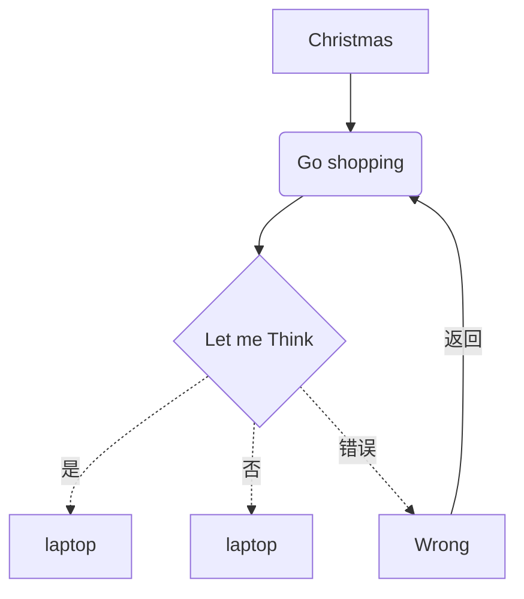
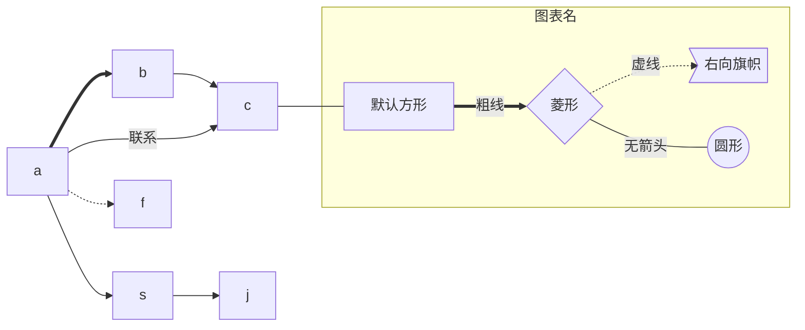
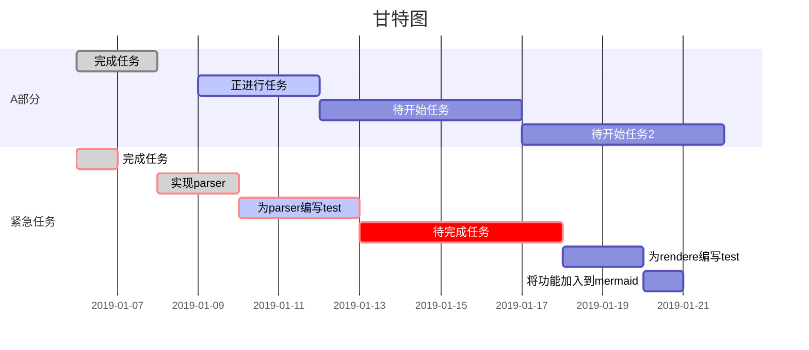
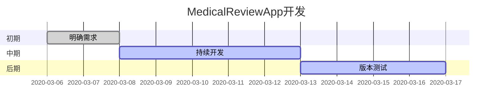

## Markdown使用方法

`总结常见用法，“多学、多记、多思”`


<!-- @import "[TOC]" {cmd="toc" depthFrom=1 depthTo=6 orderedList=false} -->

<!-- code_chunk_output -->

- [Markdown使用方法](#markdown%E4%BD%BF%E7%94%A8%E6%96%B9%E6%B3%95)
  - [字体设置](#%E5%AD%97%E4%BD%93%E8%AE%BE%E7%BD%AE)
  - [Image 添加](#image-%E6%B7%BB%E5%8A%A0)
  - [代码高亮](#%E4%BB%A3%E7%A0%81%E9%AB%98%E4%BA%AE)
  - [Todo list](#todo-list)
  - [flowChart](#flowchart)
    - [flow vertical](#flow-vertical)
    - [flow horizontal](#flow-horizontal)
  - [Gantte](#gantte)
  - [Table](#table)
  - [Math](#math)
  - [Article](#article)
- [接口描述模板](#%E6%8E%A5%E5%8F%A3%E6%8F%8F%E8%BF%B0%E6%A8%A1%E6%9D%BF)
  - [读取接口](#%E8%AF%BB%E5%8F%96%E6%8E%A5%E5%8F%A3)
  - [写入接口](#%E5%86%99%E5%85%A5%E6%8E%A5%E5%8F%A3)
  - [请求方法](#%E8%AF%B7%E6%B1%82%E6%96%B9%E6%B3%95)
    - [错误返回值](#%E9%94%99%E8%AF%AF%E8%BF%94%E5%9B%9E%E5%80%BC)
    - [错误代码对照表](#%E9%94%99%E8%AF%AF%E4%BB%A3%E7%A0%81%E5%AF%B9%E7%85%A7%E8%A1%A8)
      - [系统级错误](#%E7%B3%BB%E7%BB%9F%E7%BA%A7%E9%94%99%E8%AF%AF)
      - [业务级错误](#%E4%B8%9A%E5%8A%A1%E7%BA%A7%E9%94%99%E8%AF%AF)
- [Tab](#tab)

<!-- /code_chunk_output -->


### 字体设置

**黑体**
<font color=#FF0000>红色字</font>

### Image 添加


### 代码高亮

**Python**

```python

def prn():
    print "working"

prn()
```

**Json**

```json
{
  "app_id": "", // app id 必填
  "app_key": "", // app key 必填
  "trial": 0, // 是否是正式版。0:试用版， 1:正式版
  "extra": "" // 附加字段
}
```

### Todo list

- [ ] 未完成
- [ ] 已完成
- [ ] 已完成
- [x] 已完成
- [x] 已完成
- [x] 已完成
- [x] 已完成

### flowChart

#### flow vertical



#### flow horizontal



### Gantte





### Table

| 字段名 1 | 字段名 2 |
| -------- | -------- |
| a        | 100      |
| b        | 100      |

### Math

$$\sum_{i=1}^n a_i=0$$

### Article

1. Markdown 简介
   1. test
   2. test1
      1. test
      2. test
   3. test2
   4. test3
2. Markdown 简介
3. Markdown 简介
4. Markdown 简介

---

## 接口描述模板

### 读取接口

|               A               | B              |
| :---------------------------: | :------------- |
| [users/mobile](#users-mobile) | 获取用户手机号 |

### 写入接口

|                   A                   | B              |
| :-----------------------------------: | :------------- |
| [users/mobile/put](#users-mobile-put) | 上传用户手机号 |

|  必选  | 类型 | 说明 |
| :----: | :--- | :--- |
| userId | true | int  | 用户 ID |

### 请求方法

> GET

#### 错误返回值

| code | msg  | 说明 |
| ---- | ---- | ---- |
| 1010 | xxxx | xxxx |

关于其它错误返回值与错误代码，参见 [错误代码说明](#errorcode)

#### 错误代码对照表

##### 系统级错误

| 错误代码 | 返回 msg             | 详细描述       |
| :------: | :------------------- | -------------- |
|   400    | 系统错误，请稍候再试 | 请求参数有误   |
|   401    | 系统错误，请稍候再试 | 用户未登录     |
|   404    | 系统错误，请稍候再试 | 资源未找到     |
|   405    | 系统错误，请稍候再试 | 请求方法不支持 |
|   500    | 系统错误，请稍候再试 | 服务器错误     |

##### 业务级错误

| 错误代码 | 详细描述 |
| :------: | :------- |
|   1010   | xxxx     |

##**Ditta**

```ditaa {cmd=true args=["-E"]}
  +--------+   +-------+    +-------+
  |        | --+ ditaa +--> |       |
  |  Text  |   +-------+    |diagram|
  |Document|   |!magic!|    |       |
  |     {d}|   |       |    |       |
  +---+----+   +-------+    +-------+
      :                         ^
      |       Lots of work      |
      +-------------------------+
```

## Tab
```
<!-- tabs:start -->

#### ** English **

Hello!

#### ** French **

Bonjour!

#### ** Italian **

Ciao!

<!-- tabs:end -->
```